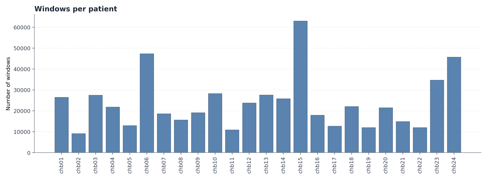
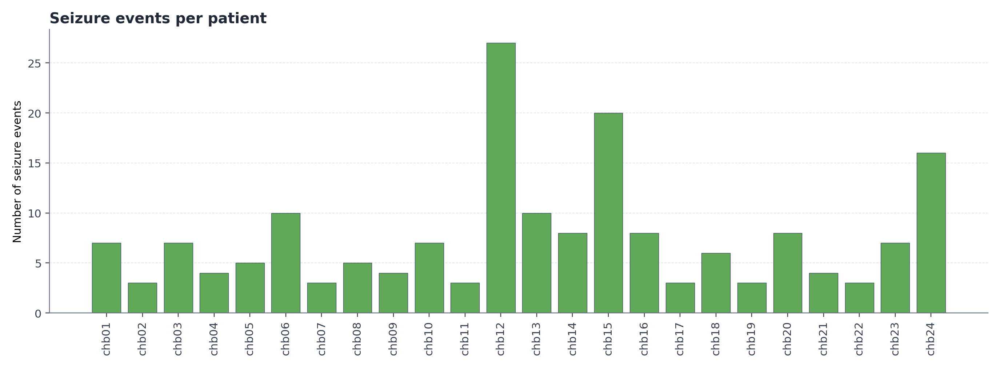
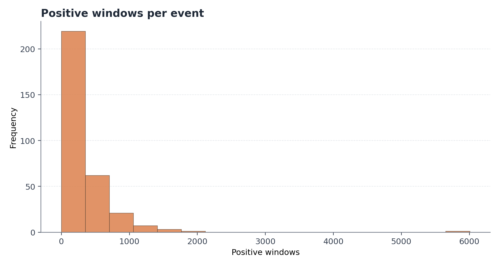
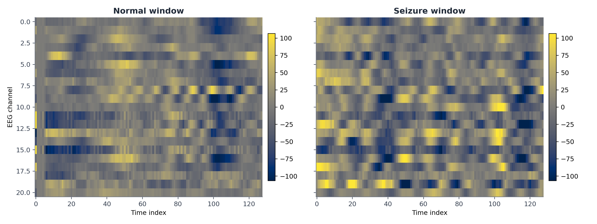
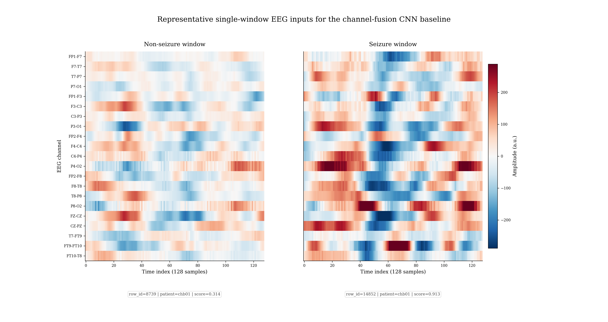
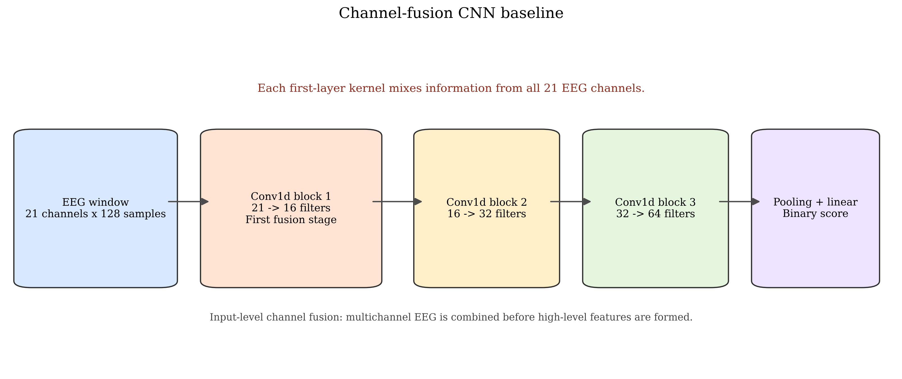
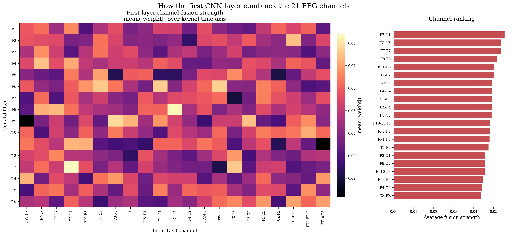
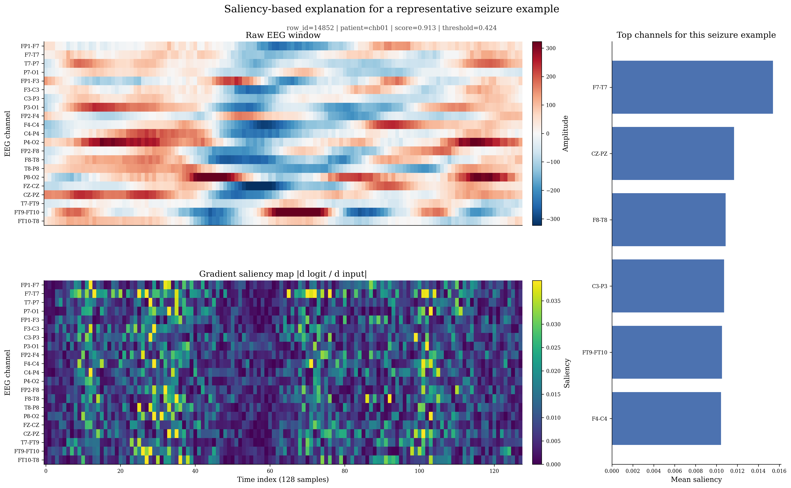
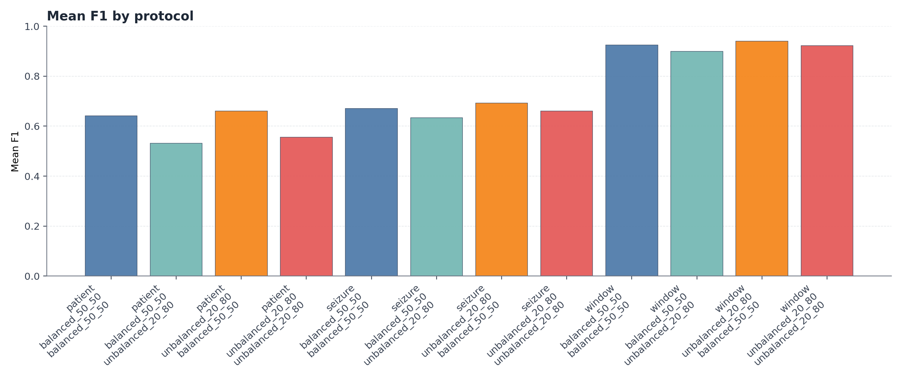
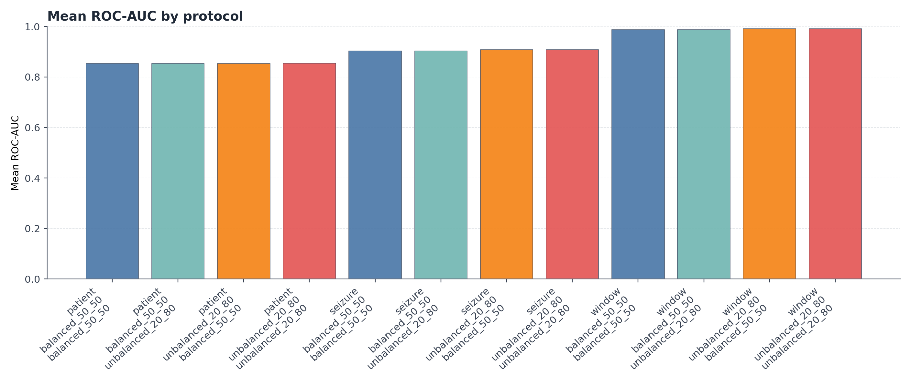

# README Mirror of `main_pipeline.ipynb`

> This file is a static mirror of the notebook workflow. It keeps the notebook's markdown, code, tables, and figures in README form.

# Epilepsy Detection

```python
import os
from pathlib import Path
import json
import html
import pandas as pd
os.environ.setdefault('MPLCONFIGDIR', '/hhome/ricse03/Deep_Learning_Group 3/homework_wenqi/.mplconfig')
import matplotlib.pyplot as plt
try:
    from IPython.display import HTML, Image, Markdown, display
except ModuleNotFoundError:
    class HTML(str):
        pass

    class Markdown(str):
        pass

    class Image:
        def __init__(self, filename=None, width=None):
            self.filename = filename
            self.width = width

        def __repr__(self):
            return f'Image(filename={self.filename}, width={self.width})'

    def display(obj):
        print(obj)

ROOT = Path.cwd()
if not (ROOT / 'fold1_data_intake').exists():
    ROOT = Path('/hhome/ricse03/Deep_Learning_Group 3/homework_wenqi')

pd.set_option('display.max_columns', 50)
pd.set_option('display.max_rows', 20)

def load_json(path):
    return json.loads(path.read_text(encoding='utf-8')) if path.exists() else None

def artifact_card(title, path, note=''):
    exists = Path(path).exists()
    color = '#2ca02c' if exists else '#d62728'
    status = 'READY' if exists else 'MISSING'
    html = f"""
    <div style='border:1px solid #ddd;border-left:8px solid {color};padding:12px 16px;margin:10px 0;border-radius:10px;background:#fafafa;'>
      <div style='font-size:18px;font-weight:700;'>{title}</div>
      <div style='margin-top:4px;color:#444;'><code>{path}</code></div>
      <div style='margin-top:8px;font-weight:600;color:{color};'>{status}</div>
      <div style='margin-top:6px;color:#555;'>{note}</div>
    </div>
    """
    display(HTML(html))

def section_header(title, subtitle=''):
    display(HTML(f"<div style='margin-top:28px;margin-bottom:10px;'><h2 style='margin-bottom:4px;'>{title}</h2><div style='color:#555;'>{subtitle}</div></div>"))

def show_preview(path, n=200, auto_full_threshold=200):
    path = Path(path)
    if not path.exists():
        display(Markdown(f"**Missing:** `{path}`"))
        return
    if path.suffix == '.csv':
        frame = pd.read_csv(path)
        limit = len(frame) if len(frame) <= auto_full_threshold else n
        display(frame.head(limit))
        if len(frame) > limit:
            display(Markdown(f"_Preview truncated: showing first {limit} of {len(frame)} rows._"))
    elif path.suffix == '.parquet':
        frame = pd.read_parquet(path)
        limit = len(frame) if len(frame) <= auto_full_threshold else n
        display(frame.head(limit))
        if len(frame) > limit:
            display(Markdown(f"_Preview truncated: showing first {limit} of {len(frame)} rows._"))
    elif path.suffix in {'.md', '.txt'}:
        display(Markdown(path.read_text(encoding='utf-8')))
    elif path.suffix == '.json':
        display(pd.json_normalize(load_json(path)))
    else:
        display(Markdown(f"Preview not implemented for `{path}`"))

FIGURE_NOTES_PATH = ROOT / 'fold7_results_and_reporting' / 'figure_notes_bilingual.json'
FIGURE_NOTES = load_json(FIGURE_NOTES_PATH) or {}

def show_image(path, width=900):
    path = Path(path)
    if path.exists():
        display(Image(filename=str(path), width=width))
    else:
        display(Markdown(f"**Missing image:** `{path}`"))

def show_figure_note(note_key):
    note = FIGURE_NOTES.get(note_key)
    if not note:
        display(Markdown(f"**Missing figure note:** `{note_key}`"))
        return
    card_html = f"""
    <div style='margin:10px 0 24px 0;padding:14px 16px;border:1px solid #ddd4c5;border-left:6px solid #8c5a3c;border-radius:12px;background:#fffdf8;'>
      <div style='font-size:16px;font-weight:700;color:#1f2937;'>{html.escape(note['zh_title'])}</div>
      <div style='margin-top:8px;color:#374151;line-height:1.68;'><strong>中文描述与分析：</strong>{html.escape(note['zh_text'])}</div>
      <div style='margin-top:14px;font-size:16px;font-weight:700;color:#1f2937;'>{html.escape(note['en_title'])}</div>
      <div style='margin-top:8px;color:#374151;line-height:1.68;'><strong>English Description and Analysis:</strong> {html.escape(note['en_text'])}</div>
    </div>
    """
    display(HTML(card_html))

def show_figure(path, note_key=None, width=900):
    show_image(path, width=width)
    if note_key is not None:
        show_figure_note(note_key)

def collect_status_table():
    rows = []
    for status_path in sorted((ROOT / 'fold5_cnn_training' / 'runs').glob('*/*/shard_*/status.json')):
        payload = load_json(status_path)
        rows.append({
            'protocol': payload.get('protocol'),
            'train_mode': payload.get('train_mode'),
            'shard': status_path.parent.name,
            'status': payload.get('status'),
            'device': payload.get('device'),
            'completed_folds': len(payload.get('completed_folds', [])),
            'failed_folds': len(payload.get('failed_folds', [])),
        })
    return pd.DataFrame(rows)

section_header('Project Root', str(ROOT))
artifact_card('Main notebook root', ROOT, 'All fold outputs are loaded from here.')
```

### Project Root

/export/hhome/ricse03/Deep_Learning_Group 3/homework_wenqi

> **Main notebook root**  
> Path: `./`  
> Status: `READY`  
> All fold outputs are loaded from here.

## Runtime Status

**Goal**
- Check whether the tmux/GPU jobs have produced artifacts yet.

**What We Load**
- `fold5_cnn_training/runs/*/*/shard_*/status.json`

**Human Takeaway**
- If this table is empty, the project structure exists but no training slice has completed yet.

```python
status_df = collect_status_table()
if status_df.empty:
    display(Markdown('**No shard status files found yet.**'))
else:
    display(status_df.sort_values(['protocol', 'train_mode', 'shard']).reset_index(drop=True))
```

<table class="dataframe">
  <thead>
    <tr style="text-align: right;">
      <th>protocol</th>
      <th>train_mode</th>
      <th>shard</th>
      <th>status</th>
      <th>device</th>
      <th>completed_folds</th>
      <th>failed_folds</th>
    </tr>
  </thead>
  <tbody>
    <tr>
      <td>patient</td>
      <td>balanced_50_50</td>
      <td>shard_00_of_01</td>
      <td>done</td>
      <td>cuda</td>
      <td>24</td>
      <td>0</td>
    </tr>
    <tr>
      <td>patient</td>
      <td>unbalanced_20_80</td>
      <td>shard_00_of_01</td>
      <td>done</td>
      <td>cuda</td>
      <td>24</td>
      <td>0</td>
    </tr>
    <tr>
      <td>seizure</td>
      <td>balanced_50_50</td>
      <td>shard_00_of_03</td>
      <td>done</td>
      <td>cuda</td>
      <td>61</td>
      <td>0</td>
    </tr>
    <tr>
      <td>seizure</td>
      <td>balanced_50_50</td>
      <td>shard_01_of_03</td>
      <td>done</td>
      <td>cuda</td>
      <td>60</td>
      <td>0</td>
    </tr>
    <tr>
      <td>seizure</td>
      <td>balanced_50_50</td>
      <td>shard_02_of_03</td>
      <td>done</td>
      <td>cuda</td>
      <td>60</td>
      <td>0</td>
    </tr>
    <tr>
      <td>seizure</td>
      <td>unbalanced_20_80</td>
      <td>shard_00_of_03</td>
      <td>done</td>
      <td>cuda</td>
      <td>61</td>
      <td>0</td>
    </tr>
    <tr>
      <td>seizure</td>
      <td>unbalanced_20_80</td>
      <td>shard_01_of_03</td>
      <td>done</td>
      <td>cuda</td>
      <td>60</td>
      <td>0</td>
    </tr>
    <tr>
      <td>seizure</td>
      <td>unbalanced_20_80</td>
      <td>shard_02_of_03</td>
      <td>done</td>
      <td>cuda</td>
      <td>60</td>
      <td>0</td>
    </tr>
    <tr>
      <td>window</td>
      <td>balanced_50_50</td>
      <td>shard_00_of_01</td>
      <td>done</td>
      <td>cuda</td>
      <td>15</td>
      <td>0</td>
    </tr>
    <tr>
      <td>window</td>
      <td>unbalanced_20_80</td>
      <td>shard_00_of_01</td>
      <td>done</td>
      <td>cuda</td>
      <td>15</td>
      <td>0</td>
    </tr>
  </tbody>
</table>

## Fold 1: Data Intake

**Goal**
- Build a single trusted master index over the EEG windows.

**What We Load**
- `data/epilepsy`

**What We Produce**
- `master_index.parquet`
- `patient_inventory.csv`
- `integrity_report.json`
- `data_contract.md`

**Sanity Checks**
- `row_id` must be unique.
- Metadata row counts must match EEG window counts.

**Human Takeaway**
- This fold is the contract for every downstream split, cache, train, and evaluation step.

```python
artifact_card('Master index', ROOT / 'fold1_data_intake' / 'master_index.parquet', 'Window-level index used by every split.')
artifact_card('Integrity report', ROOT / 'fold1_data_intake' / 'integrity_report.json', 'Verifies row counts and uniqueness.')
show_preview(ROOT / 'fold1_data_intake' / 'patient_inventory.csv')
show_preview(ROOT / 'fold1_data_intake' / 'integrity_report.json')
show_preview(ROOT / 'fold1_data_intake' / 'data_contract.md')
```

> **Master index**  
> Path: `./fold1_data_intake/master_index.parquet`  
> Status: `READY`  
> Window-level index used by every split.

> **Integrity report**  
> Path: `./fold1_data_intake/integrity_report.json`  
> Status: `READY`  
> Verifies row counts and uniqueness.

<table class="dataframe">
  <thead>
    <tr style="text-align: right;">
      <th>patient_id</th>
      <th>n_windows</th>
      <th>n_pos_windows</th>
      <th>n_neg_windows</th>
      <th>n_files</th>
      <th>n_events</th>
    </tr>
  </thead>
  <tbody>
    <tr>
      <td>chb01</td>
      <td>26529</td>
      <td>3480</td>
      <td>23049</td>
      <td>7</td>
      <td>7</td>
    </tr>
    <tr>
      <td>chb02</td>
      <td>9153</td>
      <td>1352</td>
      <td>7801</td>
      <td>3</td>
      <td>3</td>
    </tr>
    <tr>
      <td>chb03</td>
      <td>27524</td>
      <td>3160</td>
      <td>24364</td>
      <td>7</td>
      <td>7</td>
    </tr>
    <tr>
      <td>chb04</td>
      <td>21860</td>
      <td>2992</td>
      <td>18868</td>
      <td>3</td>
      <td>4</td>
    </tr>
    <tr>
      <td>chb05</td>
      <td>12992</td>
      <td>4424</td>
      <td>8568</td>
      <td>5</td>
      <td>5</td>
    </tr>
    <tr>
      <td>chb06</td>
      <td>47370</td>
      <td>1144</td>
      <td>46226</td>
      <td>7</td>
      <td>10</td>
    </tr>
    <tr>
      <td>chb07</td>
      <td>18591</td>
      <td>2576</td>
      <td>16015</td>
      <td>3</td>
      <td>3</td>
    </tr>
    <tr>
      <td>chb08</td>
      <td>15700</td>
      <td>7312</td>
      <td>8388</td>
      <td>5</td>
      <td>5</td>
    </tr>
    <tr>
      <td>chb09</td>
      <td>19165</td>
      <td>2176</td>
      <td>16989</td>
      <td>3</td>
      <td>4</td>
    </tr>
    <tr>
      <td>chb10</td>
      <td>28315</td>
      <td>3520</td>
      <td>24795</td>
      <td>7</td>
      <td>7</td>
    </tr>
    <tr>
      <td>chb11</td>
      <td>10959</td>
      <td>6424</td>
      <td>4535</td>
      <td>3</td>
      <td>3</td>
    </tr>
    <tr>
      <td>chb12</td>
      <td>23810</td>
      <td>7696</td>
      <td>16114</td>
      <td>10</td>
      <td>27</td>
    </tr>
    <tr>
      <td>chb13</td>
      <td>27583</td>
      <td>3440</td>
      <td>24143</td>
      <td>7</td>
      <td>10</td>
    </tr>
    <tr>
      <td>chb14</td>
      <td>25824</td>
      <td>1288</td>
      <td>24536</td>
      <td>7</td>
      <td>8</td>
    </tr>
    <tr>
      <td>chb15</td>
      <td>62984</td>
      <td>15776</td>
      <td>47208</td>
      <td>14</td>
      <td>20</td>
    </tr>
    <tr>
      <td>chb16</td>
      <td>17926</td>
      <td>488</td>
      <td>17438</td>
      <td>5</td>
      <td>8</td>
    </tr>
    <tr>
      <td>chb17</td>
      <td>12665</td>
      <td>2320</td>
      <td>10345</td>
      <td>3</td>
      <td>3</td>
    </tr>
    <tr>
      <td>chb18</td>
      <td>22073</td>
      <td>2488</td>
      <td>19585</td>
      <td>6</td>
      <td>6</td>
    </tr>
    <tr>
      <td>chb19</td>
      <td>11988</td>
      <td>1864</td>
      <td>10124</td>
      <td>3</td>
      <td>3</td>
    </tr>
    <tr>
      <td>chb20</td>
      <td>21536</td>
      <td>2288</td>
      <td>19248</td>
      <td>6</td>
      <td>8</td>
    </tr>
    <tr>
      <td>chb21</td>
      <td>14903</td>
      <td>1560</td>
      <td>13343</td>
      <td>4</td>
      <td>4</td>
    </tr>
    <tr>
      <td>chb22</td>
      <td>12018</td>
      <td>1608</td>
      <td>10410</td>
      <td>3</td>
      <td>3</td>
    </tr>
    <tr>
      <td>chb23</td>
      <td>34736</td>
      <td>3336</td>
      <td>31400</td>
      <td>3</td>
      <td>7</td>
    </tr>
    <tr>
      <td>chb24</td>
      <td>45701</td>
      <td>3960</td>
      <td>41741</td>
      <td>12</td>
      <td>16</td>
    </tr>
  </tbody>
</table>

<table class="dataframe">
  <thead>
    <tr style="text-align: right;">
      <th>data_root</th>
      <th>master_index_path</th>
      <th>mismatches</th>
      <th>n_neg_windows</th>
      <th>n_patients</th>
      <th>n_pos_windows</th>
      <th>n_rows</th>
      <th>row_id_unique</th>
      <th>signal_key</th>
      <th>signal_shape</th>
    </tr>
  </thead>
  <tbody>
    <tr>
      <td>/export/hhome/ricse03/Deep_Learning_Group 3/homework_wenqi/data/epilepsy</td>
      <td>/export/hhome/ricse03/Deep_Learning_Group 3/homework_wenqi/fold1_data_intake/master_index.parquet</td>
      <td>[]</td>
      <td>485233</td>
      <td>24</td>
      <td>86672</td>
      <td>571905</td>
      <td>True</td>
      <td>EEG_win</td>
      <td>[21, 128]</td>
    </tr>
  </tbody>
</table>

# Data Contract

- Raw data symlink: `/export/hhome/ricse03/Deep_Learning_Group 3/homework_wenqi/data/epilepsy`
- Master index: `/export/hhome/ricse03/Deep_Learning_Group 3/homework_wenqi/fold1_data_intake/master_index.parquet`
- Expected signal key: `EEG_win`
- Expected window shape: `(21, 128)`
- Patients discovered: `24`
- Windows discovered: `571905`

## Master Index Columns

- `row_id`: global unique window id
- `patient_id`: subject identifier
- `class_label`: 0 normal / 1 seizure
- `filename_interval`: recording-local interval id
- `global_interval`: patient-level seizure/event id
- `filename`: EDF filename
- `window_idx_in_patient`: row index inside the patient signal tensor
- `source_npz_path`: raw window file
- `signal_key`: array key inside the npz
- `signal_shape`: textual `21x128` marker

## Fold 2: Split Protocols

**Goal**
- Lock the three evaluation questions before we interpret any plots: window upper bound, unseen seizure event, and unseen patient.

**Artifact Folder**
- `fold3_split_protocols/`

**Why This Comes Here In The Notebook**
- Readers should understand the holdout logic before reading the descriptive plots and later model results.

**What We Produce**
- `window_manifest.parquet`
- `seizure_manifest.parquet`
- `patient_manifest.parquet`
- `normal_only_recordings.parquet`
- `normal_only_intervals.parquet`
- `split_qc_report.md`
- `window_overlap_summary.csv`

**Human Takeaway**
- The three protocols answer different generalization questions, so every downstream training and report table must keep them separate.

```python
section_header('Fold 2 Artifact View', 'Protocol design is shown before the audit plots so the reader knows what each experiment is testing.')
artifact_card('Split protocol folder', ROOT / 'fold3_split_protocols', 'Contains the three holdout manifests and leakage-control artifacts.')
show_preview(ROOT / 'fold3_split_protocols' / 'split_qc_report.md')
show_preview(ROOT / 'fold3_split_protocols' / 'window_manifest.parquet')
show_preview(ROOT / 'fold3_split_protocols' / 'seizure_manifest.parquet')
show_preview(ROOT / 'fold3_split_protocols' / 'patient_manifest.parquet')
show_preview(ROOT / 'fold3_split_protocols' / 'normal_only_recordings.parquet')
show_preview(ROOT / 'fold3_split_protocols' / 'normal_only_intervals.parquet')
show_preview(ROOT / 'fold3_split_protocols' / 'window_overlap_summary.csv')
```

### Fold 2 Artifact View

Protocol design is shown before the audit plots so the reader knows what each experiment is testing.

> **Split protocol folder**  
> Path: `./fold3_split_protocols`  
> Status: `READY`  
> Contains the three holdout manifests and leakage-control artifacts.

# Split QC Report

- Window folds: `15`
- Seizure folds: `181`
- Patient folds: `24`
- Normal-only recordings: `0`
- Normal-only intervals: `133`

## Notes

- Window folds intentionally allow patient and event overlap between train and test.
- Seizure folds are keyed by `(patient_id, global_interval)` and prefer normal-only recordings for negatives.
- If a patient has no normal-only recording, the code falls back to normal-only intervals inside that patient.
- Patient folds are leave-one-subject-out.

<table class="dataframe">
  <thead>
    <tr style="text-align: right;">
      <th>row_id</th>
      <th>outer_fold_id</th>
      <th>group_id</th>
      <th>protocol</th>
    </tr>
  </thead>
  <tbody>
    <tr>
      <td>0</td>
      <td>8</td>
      <td>0</td>
      <td>window</td>
    </tr>
    <tr>
      <td>1</td>
      <td>13</td>
      <td>1</td>
      <td>window</td>
    </tr>
    <tr>
      <td>2</td>
      <td>0</td>
      <td>2</td>
      <td>window</td>
    </tr>
    <tr>
      <td>3</td>
      <td>4</td>
      <td>3</td>
      <td>window</td>
    </tr>
    <tr>
      <td>4</td>
      <td>13</td>
      <td>4</td>
      <td>window</td>
    </tr>
    <tr>
      <td>5</td>
      <td>9</td>
      <td>5</td>
      <td>window</td>
    </tr>
    <tr>
      <td>6</td>
      <td>3</td>
      <td>6</td>
      <td>window</td>
    </tr>
    <tr>
      <td>7</td>
      <td>9</td>
      <td>7</td>
      <td>window</td>
    </tr>
    <tr>
      <td>8</td>
      <td>6</td>
      <td>8</td>
      <td>window</td>
    </tr>
    <tr>
      <td>9</td>
      <td>10</td>
      <td>9</td>
      <td>window</td>
    </tr>
    <tr>
      <td>10</td>
      <td>10</td>
      <td>10</td>
      <td>window</td>
    </tr>
    <tr>
      <td>11</td>
      <td>7</td>
      <td>11</td>
      <td>window</td>
    </tr>
    <tr>
      <td>12</td>
      <td>7</td>
      <td>12</td>
      <td>window</td>
    </tr>
    <tr>
      <td>13</td>
      <td>4</td>
      <td>13</td>
      <td>window</td>
    </tr>
    <tr>
      <td>14</td>
      <td>10</td>
      <td>14</td>
      <td>window</td>
    </tr>
    <tr>
      <td>15</td>
      <td>7</td>
      <td>15</td>
      <td>window</td>
    </tr>
    <tr>
      <td>16</td>
      <td>5</td>
      <td>16</td>
      <td>window</td>
    </tr>
    <tr>
      <td>17</td>
      <td>0</td>
      <td>17</td>
      <td>window</td>
    </tr>
    <tr>
      <td>18</td>
      <td>12</td>
      <td>18</td>
      <td>window</td>
    </tr>
    <tr>
      <td>19</td>
      <td>0</td>
      <td>19</td>
      <td>window</td>
    </tr>
    <tr>
      <td>20</td>
      <td>1</td>
      <td>20</td>
      <td>window</td>
    </tr>
    <tr>
      <td>21</td>
      <td>8</td>
      <td>21</td>
      <td>window</td>
    </tr>
    <tr>
      <td>22</td>
      <td>13</td>
      <td>22</td>
      <td>window</td>
    </tr>
    <tr>
      <td>23</td>
      <td>5</td>
      <td>23</td>
      <td>window</td>
    </tr>
    <tr>
      <td>24</td>
      <td>2</td>
      <td>24</td>
      <td>window</td>
    </tr>
    <tr>
      <td>25</td>
      <td>4</td>
      <td>25</td>
      <td>window</td>
    </tr>
    <tr>
      <td>26</td>
      <td>7</td>
      <td>26</td>
      <td>window</td>
    </tr>
    <tr>
      <td>27</td>
      <td>3</td>
      <td>27</td>
      <td>window</td>
    </tr>
    <tr>
      <td>28</td>
      <td>5</td>
      <td>28</td>
      <td>window</td>
    </tr>
    <tr>
      <td>29</td>
      <td>3</td>
      <td>29</td>
      <td>window</td>
    </tr>
    <tr>
      <td>30</td>
      <td>2</td>
      <td>30</td>
      <td>window</td>
    </tr>
    <tr>
      <td>31</td>
      <td>12</td>
      <td>31</td>
      <td>window</td>
    </tr>
    <tr>
      <td>32</td>
      <td>12</td>
      <td>32</td>
      <td>window</td>
    </tr>
    <tr>
      <td>33</td>
      <td>13</td>
      <td>33</td>
      <td>window</td>
    </tr>
    <tr>
      <td>34</td>
      <td>5</td>
      <td>34</td>
      <td>window</td>
    </tr>
    <tr>
      <td>35</td>
      <td>0</td>
      <td>35</td>
      <td>window</td>
    </tr>
    <tr>
      <td>36</td>
      <td>2</td>
      <td>36</td>
      <td>window</td>
    </tr>
    <tr>
      <td>37</td>
      <td>4</td>
      <td>37</td>
      <td>window</td>
    </tr>
    <tr>
      <td>38</td>
      <td>14</td>
      <td>38</td>
      <td>window</td>
    </tr>
    <tr>
      <td>39</td>
      <td>12</td>
      <td>39</td>
      <td>window</td>
    </tr>
    <tr>
      <td>40</td>
      <td>10</td>
      <td>40</td>
      <td>window</td>
    </tr>
    <tr>
      <td>41</td>
      <td>6</td>
      <td>41</td>
      <td>window</td>
    </tr>
    <tr>
      <td>42</td>
      <td>9</td>
      <td>42</td>
      <td>window</td>
    </tr>
    <tr>
      <td>43</td>
      <td>8</td>
      <td>43</td>
      <td>window</td>
    </tr>
    <tr>
      <td>44</td>
      <td>6</td>
      <td>44</td>
      <td>window</td>
    </tr>
    <tr>
      <td>45</td>
      <td>12</td>
      <td>45</td>
      <td>window</td>
    </tr>
    <tr>
      <td>46</td>
      <td>13</td>
      <td>46</td>
      <td>window</td>
    </tr>
    <tr>
      <td>47</td>
      <td>0</td>
      <td>47</td>
      <td>window</td>
    </tr>
    <tr>
      <td>48</td>
      <td>10</td>
      <td>48</td>
      <td>window</td>
    </tr>
    <tr>
      <td>49</td>
      <td>9</td>
      <td>49</td>
      <td>window</td>
    </tr>
    <tr>
      <td>50</td>
      <td>11</td>
      <td>50</td>
      <td>window</td>
    </tr>
    <tr>
      <td>51</td>
      <td>8</td>
      <td>51</td>
      <td>window</td>
    </tr>
    <tr>
      <td>52</td>
      <td>6</td>
      <td>52</td>
      <td>window</td>
    </tr>
    <tr>
      <td>53</td>
      <td>4</td>
      <td>53</td>
      <td>window</td>
    </tr>
    <tr>
      <td>54</td>
      <td>11</td>
      <td>54</td>
      <td>window</td>
    </tr>
    <tr>
      <td>55</td>
      <td>10</td>
      <td>55</td>
      <td>window</td>
    </tr>
    <tr>
      <td>56</td>
      <td>3</td>
      <td>56</td>
      <td>window</td>
    </tr>
    <tr>
      <td>57</td>
      <td>0</td>
      <td>57</td>
      <td>window</td>
    </tr>
    <tr>
      <td>58</td>
      <td>13</td>
      <td>58</td>
      <td>window</td>
    </tr>
    <tr>
      <td>59</td>
      <td>12</td>
      <td>59</td>
      <td>window</td>
    </tr>
    <tr>
      <td>60</td>
      <td>3</td>
      <td>60</td>
      <td>window</td>
    </tr>
    <tr>
      <td>61</td>
      <td>9</td>
      <td>61</td>
      <td>window</td>
    </tr>
    <tr>
      <td>62</td>
      <td>0</td>
      <td>62</td>
      <td>window</td>
    </tr>
    <tr>
      <td>63</td>
      <td>4</td>
      <td>63</td>
      <td>window</td>
    </tr>
    <tr>
      <td>64</td>
      <td>9</td>
      <td>64</td>
      <td>window</td>
    </tr>
    <tr>
      <td>65</td>
      <td>0</td>
      <td>65</td>
      <td>window</td>
    </tr>
    <tr>
      <td>66</td>
      <td>10</td>
      <td>66</td>
      <td>window</td>
    </tr>
    <tr>
      <td>67</td>
      <td>12</td>
      <td>67</td>
      <td>window</td>
    </tr>
    <tr>
      <td>68</td>
      <td>13</td>
      <td>68</td>
      <td>window</td>
    </tr>
    <tr>
      <td>69</td>
      <td>6</td>
      <td>69</td>
      <td>window</td>
    </tr>
    <tr>
      <td>70</td>
      <td>11</td>
      <td>70</td>
      <td>window</td>
    </tr>
    <tr>
      <td>71</td>
      <td>9</td>
      <td>71</td>
      <td>window</td>
    </tr>
    <tr>
      <td>72</td>
      <td>13</td>
      <td>72</td>
      <td>window</td>
    </tr>
    <tr>
      <td>73</td>
      <td>1</td>
      <td>73</td>
      <td>window</td>
    </tr>
    <tr>
      <td>74</td>
      <td>4</td>
      <td>74</td>
      <td>window</td>
    </tr>
    <tr>
      <td>75</td>
      <td>12</td>
      <td>75</td>
      <td>window</td>
    </tr>
    <tr>
      <td>76</td>
      <td>14</td>
      <td>76</td>
      <td>window</td>
    </tr>
    <tr>
      <td>77</td>
      <td>10</td>
      <td>77</td>
      <td>window</td>
    </tr>
    <tr>
      <td>78</td>
      <td>5</td>
      <td>78</td>
      <td>window</td>
    </tr>
    <tr>
      <td>79</td>
      <td>13</td>
      <td>79</td>
      <td>window</td>
    </tr>
    <tr>
      <td>80</td>
      <td>11</td>
      <td>80</td>
      <td>window</td>
    </tr>
    <tr>
      <td>81</td>
      <td>13</td>
      <td>81</td>
      <td>window</td>
    </tr>
    <tr>
      <td>82</td>
      <td>0</td>
      <td>82</td>
      <td>window</td>
    </tr>
    <tr>
      <td>83</td>
      <td>3</td>
      <td>83</td>
      <td>window</td>
    </tr>
    <tr>
      <td>84</td>
      <td>0</td>
      <td>84</td>
      <td>window</td>
    </tr>
    <tr>
      <td>85</td>
      <td>10</td>
      <td>85</td>
      <td>window</td>
    </tr>
    <tr>
      <td>86</td>
      <td>9</td>
      <td>86</td>
      <td>window</td>
    </tr>
    <tr>
      <td>87</td>
      <td>5</td>
      <td>87</td>
      <td>window</td>
    </tr>
    <tr>
      <td>88</td>
      <td>6</td>
      <td>88</td>
      <td>window</td>
    </tr>
    <tr>
      <td>89</td>
      <td>7</td>
      <td>89</td>
      <td>window</td>
    </tr>
    <tr>
      <td>90</td>
      <td>3</td>
      <td>90</td>
      <td>window</td>
    </tr>
    <tr>
      <td>91</td>
      <td>2</td>
      <td>91</td>
      <td>window</td>
    </tr>
    <tr>
      <td>92</td>
      <td>2</td>
      <td>92</td>
      <td>window</td>
    </tr>
    <tr>
      <td>93</td>
      <td>9</td>
      <td>93</td>
      <td>window</td>
    </tr>
    <tr>
      <td>94</td>
      <td>14</td>
      <td>94</td>
      <td>window</td>
    </tr>
    <tr>
      <td>95</td>
      <td>0</td>
      <td>95</td>
      <td>window</td>
    </tr>
    <tr>
      <td>96</td>
      <td>1</td>
      <td>96</td>
      <td>window</td>
    </tr>
    <tr>
      <td>97</td>
      <td>0</td>
      <td>97</td>
      <td>window</td>
    </tr>
    <tr>
      <td>98</td>
      <td>8</td>
      <td>98</td>
      <td>window</td>
    </tr>
    <tr>
      <td>99</td>
      <td>9</td>
      <td>99</td>
      <td>window</td>
    </tr>
    <tr>
      <td>100</td>
      <td>0</td>
      <td>100</td>
      <td>window</td>
    </tr>
    <tr>
      <td>101</td>
      <td>1</td>
      <td>101</td>
      <td>window</td>
    </tr>
    <tr>
      <td>102</td>
      <td>10</td>
      <td>102</td>
      <td>window</td>
    </tr>
    <tr>
      <td>103</td>
      <td>11</td>
      <td>103</td>
      <td>window</td>
    </tr>
    <tr>
      <td>104</td>
      <td>12</td>
      <td>104</td>
      <td>window</td>
    </tr>
    <tr>
      <td>105</td>
      <td>4</td>
      <td>105</td>
      <td>window</td>
    </tr>
    <tr>
      <td>106</td>
      <td>10</td>
      <td>106</td>
      <td>window</td>
    </tr>
    <tr>
      <td>107</td>
      <td>10</td>
      <td>107</td>
      <td>window</td>
    </tr>
    <tr>
      <td>108</td>
      <td>7</td>
      <td>108</td>
      <td>window</td>
    </tr>
    <tr>
      <td>109</td>
      <td>2</td>
      <td>109</td>
      <td>window</td>
    </tr>
    <tr>
      <td>110</td>
      <td>2</td>
      <td>110</td>
      <td>window</td>
    </tr>
    <tr>
      <td>111</td>
      <td>11</td>
      <td>111</td>
      <td>window</td>
    </tr>
    <tr>
      <td>112</td>
      <td>0</td>
      <td>112</td>
      <td>window</td>
    </tr>
    <tr>
      <td>113</td>
      <td>2</td>
      <td>113</td>
      <td>window</td>
    </tr>
    <tr>
      <td>114</td>
      <td>12</td>
      <td>114</td>
      <td>window</td>
    </tr>
    <tr>
      <td>115</td>
      <td>8</td>
      <td>115</td>
      <td>window</td>
    </tr>
    <tr>
      <td>116</td>
      <td>12</td>
      <td>116</td>
      <td>window</td>
    </tr>
    <tr>
      <td>117</td>
      <td>1</td>
      <td>117</td>
      <td>window</td>
    </tr>
    <tr>
      <td>118</td>
      <td>1</td>
      <td>118</td>
      <td>window</td>
    </tr>
    <tr>
      <td>119</td>
      <td>13</td>
      <td>119</td>
      <td>window</td>
    </tr>
    <tr>
      <td>120</td>
      <td>6</td>
      <td>120</td>
      <td>window</td>
    </tr>
    <tr>
      <td>121</td>
      <td>10</td>
      <td>121</td>
      <td>window</td>
    </tr>
    <tr>
      <td>122</td>
      <td>2</td>
      <td>122</td>
      <td>window</td>
    </tr>
    <tr>
      <td>123</td>
      <td>13</td>
      <td>123</td>
      <td>window</td>
    </tr>
    <tr>
      <td>124</td>
      <td>9</td>
      <td>124</td>
      <td>window</td>
    </tr>
    <tr>
      <td>125</td>
      <td>6</td>
      <td>125</td>
      <td>window</td>
    </tr>
    <tr>
      <td>126</td>
      <td>6</td>
      <td>126</td>
      <td>window</td>
    </tr>
    <tr>
      <td>127</td>
      <td>12</td>
      <td>127</td>
      <td>window</td>
    </tr>
    <tr>
      <td>128</td>
      <td>11</td>
      <td>128</td>
      <td>window</td>
    </tr>
    <tr>
      <td>129</td>
      <td>10</td>
      <td>129</td>
      <td>window</td>
    </tr>
    <tr>
      <td>130</td>
      <td>12</td>
      <td>130</td>
      <td>window</td>
    </tr>
    <tr>
      <td>131</td>
      <td>14</td>
      <td>131</td>
      <td>window</td>
    </tr>
    <tr>
      <td>132</td>
      <td>3</td>
      <td>132</td>
      <td>window</td>
    </tr>
    <tr>
      <td>133</td>
      <td>14</td>
      <td>133</td>
      <td>window</td>
    </tr>
    <tr>
      <td>134</td>
      <td>13</td>
      <td>134</td>
      <td>window</td>
    </tr>
    <tr>
      <td>135</td>
      <td>3</td>
      <td>135</td>
      <td>window</td>
    </tr>
    <tr>
      <td>136</td>
      <td>0</td>
      <td>136</td>
      <td>window</td>
    </tr>
    <tr>
      <td>137</td>
      <td>5</td>
      <td>137</td>
      <td>window</td>
    </tr>
    <tr>
      <td>138</td>
      <td>11</td>
      <td>138</td>
      <td>window</td>
    </tr>
    <tr>
      <td>139</td>
      <td>9</td>
      <td>139</td>
      <td>window</td>
    </tr>
    <tr>
      <td>140</td>
      <td>11</td>
      <td>140</td>
      <td>window</td>
    </tr>
    <tr>
      <td>141</td>
      <td>0</td>
      <td>141</td>
      <td>window</td>
    </tr>
    <tr>
      <td>142</td>
      <td>12</td>
      <td>142</td>
      <td>window</td>
    </tr>
    <tr>
      <td>143</td>
      <td>13</td>
      <td>143</td>
      <td>window</td>
    </tr>
    <tr>
      <td>144</td>
      <td>13</td>
      <td>144</td>
      <td>window</td>
    </tr>
    <tr>
      <td>145</td>
      <td>13</td>
      <td>145</td>
      <td>window</td>
    </tr>
    <tr>
      <td>146</td>
      <td>10</td>
      <td>146</td>
      <td>window</td>
    </tr>
    <tr>
      <td>147</td>
      <td>2</td>
      <td>147</td>
      <td>window</td>
    </tr>
    <tr>
      <td>148</td>
      <td>8</td>
      <td>148</td>
      <td>window</td>
    </tr>
    <tr>
      <td>149</td>
      <td>5</td>
      <td>149</td>
      <td>window</td>
    </tr>
    <tr>
      <td>150</td>
      <td>8</td>
      <td>150</td>
      <td>window</td>
    </tr>
    <tr>
      <td>151</td>
      <td>2</td>
      <td>151</td>
      <td>window</td>
    </tr>
    <tr>
      <td>152</td>
      <td>7</td>
      <td>152</td>
      <td>window</td>
    </tr>
    <tr>
      <td>153</td>
      <td>11</td>
      <td>153</td>
      <td>window</td>
    </tr>
    <tr>
      <td>154</td>
      <td>1</td>
      <td>154</td>
      <td>window</td>
    </tr>
    <tr>
      <td>155</td>
      <td>12</td>
      <td>155</td>
      <td>window</td>
    </tr>
    <tr>
      <td>156</td>
      <td>0</td>
      <td>156</td>
      <td>window</td>
    </tr>
    <tr>
      <td>157</td>
      <td>8</td>
      <td>157</td>
      <td>window</td>
    </tr>
    <tr>
      <td>158</td>
      <td>10</td>
      <td>158</td>
      <td>window</td>
    </tr>
    <tr>
      <td>159</td>
      <td>14</td>
      <td>159</td>
      <td>window</td>
    </tr>
    <tr>
      <td>160</td>
      <td>8</td>
      <td>160</td>
      <td>window</td>
    </tr>
    <tr>
      <td>161</td>
      <td>10</td>
      <td>161</td>
      <td>window</td>
    </tr>
    <tr>
      <td>162</td>
      <td>4</td>
      <td>162</td>
      <td>window</td>
    </tr>
    <tr>
      <td>163</td>
      <td>2</td>
      <td>163</td>
      <td>window</td>
    </tr>
    <tr>
      <td>164</td>
      <td>14</td>
      <td>164</td>
      <td>window</td>
    </tr>
    <tr>
      <td>165</td>
      <td>10</td>
      <td>165</td>
      <td>window</td>
    </tr>
    <tr>
      <td>166</td>
      <td>10</td>
      <td>166</td>
      <td>window</td>
    </tr>
    <tr>
      <td>167</td>
      <td>9</td>
      <td>167</td>
      <td>window</td>
    </tr>
    <tr>
      <td>168</td>
      <td>14</td>
      <td>168</td>
      <td>window</td>
    </tr>
    <tr>
      <td>169</td>
      <td>2</td>
      <td>169</td>
      <td>window</td>
    </tr>
    <tr>
      <td>170</td>
      <td>12</td>
      <td>170</td>
      <td>window</td>
    </tr>
    <tr>
      <td>171</td>
      <td>6</td>
      <td>171</td>
      <td>window</td>
    </tr>
    <tr>
      <td>172</td>
      <td>9</td>
      <td>172</td>
      <td>window</td>
    </tr>
    <tr>
      <td>173</td>
      <td>3</td>
      <td>173</td>
      <td>window</td>
    </tr>
    <tr>
      <td>174</td>
      <td>12</td>
      <td>174</td>
      <td>window</td>
    </tr>
    <tr>
      <td>175</td>
      <td>11</td>
      <td>175</td>
      <td>window</td>
    </tr>
    <tr>
      <td>176</td>
      <td>13</td>
      <td>176</td>
      <td>window</td>
    </tr>
    <tr>
      <td>177</td>
      <td>14</td>
      <td>177</td>
      <td>window</td>
    </tr>
    <tr>
      <td>178</td>
      <td>11</td>
      <td>178</td>
      <td>window</td>
    </tr>
    <tr>
      <td>179</td>
      <td>13</td>
      <td>179</td>
      <td>window</td>
    </tr>
    <tr>
      <td>180</td>
      <td>11</td>
      <td>180</td>
      <td>window</td>
    </tr>
    <tr>
      <td>181</td>
      <td>13</td>
      <td>181</td>
      <td>window</td>
    </tr>
    <tr>
      <td>182</td>
      <td>0</td>
      <td>182</td>
      <td>window</td>
    </tr>
    <tr>
      <td>183</td>
      <td>5</td>
      <td>183</td>
      <td>window</td>
    </tr>
    <tr>
      <td>184</td>
      <td>3</td>
      <td>184</td>
      <td>window</td>
    </tr>
    <tr>
      <td>185</td>
      <td>0</td>
      <td>185</td>
      <td>window</td>
    </tr>
    <tr>
      <td>186</td>
      <td>3</td>
      <td>186</td>
      <td>window</td>
    </tr>
    <tr>
      <td>187</td>
      <td>2</td>
      <td>187</td>
      <td>window</td>
    </tr>
    <tr>
      <td>188</td>
      <td>10</td>
      <td>188</td>
      <td>window</td>
    </tr>
    <tr>
      <td>189</td>
      <td>3</td>
      <td>189</td>
      <td>window</td>
    </tr>
    <tr>
      <td>190</td>
      <td>1</td>
      <td>190</td>
      <td>window</td>
    </tr>
    <tr>
      <td>191</td>
      <td>1</td>
      <td>191</td>
      <td>window</td>
    </tr>
    <tr>
      <td>192</td>
      <td>10</td>
      <td>192</td>
      <td>window</td>
    </tr>
    <tr>
      <td>193</td>
      <td>12</td>
      <td>193</td>
      <td>window</td>
    </tr>
    <tr>
      <td>194</td>
      <td>13</td>
      <td>194</td>
      <td>window</td>
    </tr>
    <tr>
      <td>195</td>
      <td>13</td>
      <td>195</td>
      <td>window</td>
    </tr>
    <tr>
      <td>196</td>
      <td>0</td>
      <td>196</td>
      <td>window</td>
    </tr>
    <tr>
      <td>197</td>
      <td>8</td>
      <td>197</td>
      <td>window</td>
    </tr>
    <tr>
      <td>198</td>
      <td>9</td>
      <td>198</td>
      <td>window</td>
    </tr>
    <tr>
      <td>199</td>
      <td>1</td>
      <td>199</td>
      <td>window</td>
    </tr>
  </tbody>
</table>

_Preview truncated: showing first 200 of 571905 rows._

<table class="dataframe">
  <thead>
    <tr style="text-align: right;">
      <th>patient_id</th>
      <th>global_interval</th>
      <th>outer_fold_id</th>
      <th>group_id</th>
      <th>protocol</th>
    </tr>
  </thead>
  <tbody>
    <tr>
      <td>chb01</td>
      <td>1</td>
      <td>0</td>
      <td>chb01__1</td>
      <td>seizure</td>
    </tr>
    <tr>
      <td>chb01</td>
      <td>2</td>
      <td>1</td>
      <td>chb01__2</td>
      <td>seizure</td>
    </tr>
    <tr>
      <td>chb01</td>
      <td>3</td>
      <td>2</td>
      <td>chb01__3</td>
      <td>seizure</td>
    </tr>
    <tr>
      <td>chb01</td>
      <td>4</td>
      <td>3</td>
      <td>chb01__4</td>
      <td>seizure</td>
    </tr>
    <tr>
      <td>chb01</td>
      <td>5</td>
      <td>4</td>
      <td>chb01__5</td>
      <td>seizure</td>
    </tr>
    <tr>
      <td>chb01</td>
      <td>6</td>
      <td>5</td>
      <td>chb01__6</td>
      <td>seizure</td>
    </tr>
    <tr>
      <td>chb01</td>
      <td>7</td>
      <td>6</td>
      <td>chb01__7</td>
      <td>seizure</td>
    </tr>
    <tr>
      <td>chb02</td>
      <td>1</td>
      <td>7</td>
      <td>chb02__1</td>
      <td>seizure</td>
    </tr>
    <tr>
      <td>chb02</td>
      <td>2</td>
      <td>8</td>
      <td>chb02__2</td>
      <td>seizure</td>
    </tr>
    <tr>
      <td>chb02</td>
      <td>3</td>
      <td>9</td>
      <td>chb02__3</td>
      <td>seizure</td>
    </tr>
    <tr>
      <td>chb03</td>
      <td>1</td>
      <td>10</td>
      <td>chb03__1</td>
      <td>seizure</td>
    </tr>
    <tr>
      <td>chb03</td>
      <td>2</td>
      <td>11</td>
      <td>chb03__2</td>
      <td>seizure</td>
    </tr>
    <tr>
      <td>chb03</td>
      <td>3</td>
      <td>12</td>
      <td>chb03__3</td>
      <td>seizure</td>
    </tr>
    <tr>
      <td>chb03</td>
      <td>4</td>
      <td>13</td>
      <td>chb03__4</td>
      <td>seizure</td>
    </tr>
    <tr>
      <td>chb03</td>
      <td>5</td>
      <td>14</td>
      <td>chb03__5</td>
      <td>seizure</td>
    </tr>
    <tr>
      <td>chb03</td>
      <td>6</td>
      <td>15</td>
      <td>chb03__6</td>
      <td>seizure</td>
    </tr>
    <tr>
      <td>chb03</td>
      <td>7</td>
      <td>16</td>
      <td>chb03__7</td>
      <td>seizure</td>
    </tr>
    <tr>
      <td>chb04</td>
      <td>1</td>
      <td>17</td>
      <td>chb04__1</td>
      <td>seizure</td>
    </tr>
    <tr>
      <td>chb04</td>
      <td>2</td>
      <td>18</td>
      <td>chb04__2</td>
      <td>seizure</td>
    </tr>
    <tr>
      <td>chb04</td>
      <td>3</td>
      <td>19</td>
      <td>chb04__3</td>
      <td>seizure</td>
    </tr>
    <tr>
      <td>chb04</td>
      <td>4</td>
      <td>20</td>
      <td>chb04__4</td>
      <td>seizure</td>
    </tr>
    <tr>
      <td>chb05</td>
      <td>1</td>
      <td>21</td>
      <td>chb05__1</td>
      <td>seizure</td>
    </tr>
    <tr>
      <td>chb05</td>
      <td>2</td>
      <td>22</td>
      <td>chb05__2</td>
      <td>seizure</td>
    </tr>
    <tr>
      <td>chb05</td>
      <td>3</td>
      <td>23</td>
      <td>chb05__3</td>
      <td>seizure</td>
    </tr>
    <tr>
      <td>chb05</td>
      <td>4</td>
      <td>24</td>
      <td>chb05__4</td>
      <td>seizure</td>
    </tr>
    <tr>
      <td>chb05</td>
      <td>5</td>
      <td>25</td>
      <td>chb05__5</td>
      <td>seizure</td>
    </tr>
    <tr>
      <td>chb06</td>
      <td>1</td>
      <td>26</td>
      <td>chb06__1</td>
      <td>seizure</td>
    </tr>
    <tr>
      <td>chb06</td>
      <td>2</td>
      <td>27</td>
      <td>chb06__2</td>
      <td>seizure</td>
    </tr>
    <tr>
      <td>chb06</td>
      <td>3</td>
      <td>28</td>
      <td>chb06__3</td>
      <td>seizure</td>
    </tr>
    <tr>
      <td>chb06</td>
      <td>4</td>
      <td>29</td>
      <td>chb06__4</td>
      <td>seizure</td>
    </tr>
    <tr>
      <td>chb06</td>
      <td>5</td>
      <td>30</td>
      <td>chb06__5</td>
      <td>seizure</td>
    </tr>
    <tr>
      <td>chb06</td>
      <td>6</td>
      <td>31</td>
      <td>chb06__6</td>
      <td>seizure</td>
    </tr>
    <tr>
      <td>chb06</td>
      <td>7</td>
      <td>32</td>
      <td>chb06__7</td>
      <td>seizure</td>
    </tr>
    <tr>
      <td>chb06</td>
      <td>8</td>
      <td>33</td>
      <td>chb06__8</td>
      <td>seizure</td>
    </tr>
    <tr>
      <td>chb06</td>
      <td>9</td>
      <td>34</td>
      <td>chb06__9</td>
      <td>seizure</td>
    </tr>
    <tr>
      <td>chb06</td>
      <td>10</td>
      <td>35</td>
      <td>chb06__10</td>
      <td>seizure</td>
    </tr>
    <tr>
      <td>chb07</td>
      <td>1</td>
      <td>36</td>
      <td>chb07__1</td>
      <td>seizure</td>
    </tr>
    <tr>
      <td>chb07</td>
      <td>2</td>
      <td>37</td>
      <td>chb07__2</td>
      <td>seizure</td>
    </tr>
    <tr>
      <td>chb07</td>
      <td>3</td>
      <td>38</td>
      <td>chb07__3</td>
      <td>seizure</td>
    </tr>
    <tr>
      <td>chb08</td>
      <td>1</td>
      <td>39</td>
      <td>chb08__1</td>
      <td>seizure</td>
    </tr>
    <tr>
      <td>chb08</td>
      <td>2</td>
      <td>40</td>
      <td>chb08__2</td>
      <td>seizure</td>
    </tr>
    <tr>
      <td>chb08</td>
      <td>3</td>
      <td>41</td>
      <td>chb08__3</td>
      <td>seizure</td>
    </tr>
    <tr>
      <td>chb08</td>
      <td>4</td>
      <td>42</td>
      <td>chb08__4</td>
      <td>seizure</td>
    </tr>
    <tr>
      <td>chb08</td>
      <td>5</td>
      <td>43</td>
      <td>chb08__5</td>
      <td>seizure</td>
    </tr>
    <tr>
      <td>chb09</td>
      <td>1</td>
      <td>44</td>
      <td>chb09__1</td>
      <td>seizure</td>
    </tr>
    <tr>
      <td>chb09</td>
      <td>2</td>
      <td>45</td>
      <td>chb09__2</td>
      <td>seizure</td>
    </tr>
    <tr>
      <td>chb09</td>
      <td>3</td>
      <td>46</td>
      <td>chb09__3</td>
      <td>seizure</td>
    </tr>
    <tr>
      <td>chb09</td>
      <td>4</td>
      <td>47</td>
      <td>chb09__4</td>
      <td>seizure</td>
    </tr>
    <tr>
      <td>chb10</td>
      <td>1</td>
      <td>48</td>
      <td>chb10__1</td>
      <td>seizure</td>
    </tr>
    <tr>
      <td>chb10</td>
      <td>2</td>
      <td>49</td>
      <td>chb10__2</td>
      <td>seizure</td>
    </tr>
    <tr>
      <td>chb10</td>
      <td>3</td>
      <td>50</td>
      <td>chb10__3</td>
      <td>seizure</td>
    </tr>
    <tr>
      <td>chb10</td>
      <td>4</td>
      <td>51</td>
      <td>chb10__4</td>
      <td>seizure</td>
    </tr>
    <tr>
      <td>chb10</td>
      <td>5</td>
      <td>52</td>
      <td>chb10__5</td>
      <td>seizure</td>
    </tr>
    <tr>
      <td>chb10</td>
      <td>6</td>
      <td>53</td>
      <td>chb10__6</td>
      <td>seizure</td>
    </tr>
    <tr>
      <td>chb10</td>
      <td>7</td>
      <td>54</td>
      <td>chb10__7</td>
      <td>seizure</td>
    </tr>
    <tr>
      <td>chb11</td>
      <td>1</td>
      <td>55</td>
      <td>chb11__1</td>
      <td>seizure</td>
    </tr>
    <tr>
      <td>chb11</td>
      <td>2</td>
      <td>56</td>
      <td>chb11__2</td>
      <td>seizure</td>
    </tr>
    <tr>
      <td>chb11</td>
      <td>3</td>
      <td>57</td>
      <td>chb11__3</td>
      <td>seizure</td>
    </tr>
    <tr>
      <td>chb12</td>
      <td>1</td>
      <td>58</td>
      <td>chb12__1</td>
      <td>seizure</td>
    </tr>
    <tr>
      <td>chb12</td>
      <td>2</td>
      <td>59</td>
      <td>chb12__2</td>
      <td>seizure</td>
    </tr>
    <tr>
      <td>chb12</td>
      <td>3</td>
      <td>60</td>
      <td>chb12__3</td>
      <td>seizure</td>
    </tr>
    <tr>
      <td>chb12</td>
      <td>4</td>
      <td>61</td>
      <td>chb12__4</td>
      <td>seizure</td>
    </tr>
    <tr>
      <td>chb12</td>
      <td>5</td>
      <td>62</td>
      <td>chb12__5</td>
      <td>seizure</td>
    </tr>
    <tr>
      <td>chb12</td>
      <td>6</td>
      <td>63</td>
      <td>chb12__6</td>
      <td>seizure</td>
    </tr>
    <tr>
      <td>chb12</td>
      <td>7</td>
      <td>64</td>
      <td>chb12__7</td>
      <td>seizure</td>
    </tr>
    <tr>
      <td>chb12</td>
      <td>8</td>
      <td>65</td>
      <td>chb12__8</td>
      <td>seizure</td>
    </tr>
    <tr>
      <td>chb12</td>
      <td>9</td>
      <td>66</td>
      <td>chb12__9</td>
      <td>seizure</td>
    </tr>
    <tr>
      <td>chb12</td>
      <td>10</td>
      <td>67</td>
      <td>chb12__10</td>
      <td>seizure</td>
    </tr>
    <tr>
      <td>chb12</td>
      <td>11</td>
      <td>68</td>
      <td>chb12__11</td>
      <td>seizure</td>
    </tr>
    <tr>
      <td>chb12</td>
      <td>12</td>
      <td>69</td>
      <td>chb12__12</td>
      <td>seizure</td>
    </tr>
    <tr>
      <td>chb12</td>
      <td>13</td>
      <td>70</td>
      <td>chb12__13</td>
      <td>seizure</td>
    </tr>
    <tr>
      <td>chb12</td>
      <td>14</td>
      <td>71</td>
      <td>chb12__14</td>
      <td>seizure</td>
    </tr>
    <tr>
      <td>chb12</td>
      <td>15</td>
      <td>72</td>
      <td>chb12__15</td>
      <td>seizure</td>
    </tr>
    <tr>
      <td>chb12</td>
      <td>16</td>
      <td>73</td>
      <td>chb12__16</td>
      <td>seizure</td>
    </tr>
    <tr>
      <td>chb12</td>
      <td>17</td>
      <td>74</td>
      <td>chb12__17</td>
      <td>seizure</td>
    </tr>
    <tr>
      <td>chb12</td>
      <td>18</td>
      <td>75</td>
      <td>chb12__18</td>
      <td>seizure</td>
    </tr>
    <tr>
      <td>chb12</td>
      <td>19</td>
      <td>76</td>
      <td>chb12__19</td>
      <td>seizure</td>
    </tr>
    <tr>
      <td>chb12</td>
      <td>20</td>
      <td>77</td>
      <td>chb12__20</td>
      <td>seizure</td>
    </tr>
    <tr>
      <td>chb12</td>
      <td>21</td>
      <td>78</td>
      <td>chb12__21</td>
      <td>seizure</td>
    </tr>
    <tr>
      <td>chb12</td>
      <td>22</td>
      <td>79</td>
      <td>chb12__22</td>
      <td>seizure</td>
    </tr>
    <tr>
      <td>chb12</td>
      <td>23</td>
      <td>80</td>
      <td>chb12__23</td>
      <td>seizure</td>
    </tr>
    <tr>
      <td>chb12</td>
      <td>24</td>
      <td>81</td>
      <td>chb12__24</td>
      <td>seizure</td>
    </tr>
    <tr>
      <td>chb12</td>
      <td>25</td>
      <td>82</td>
      <td>chb12__25</td>
      <td>seizure</td>
    </tr>
    <tr>
      <td>chb12</td>
      <td>26</td>
      <td>83</td>
      <td>chb12__26</td>
      <td>seizure</td>
    </tr>
    <tr>
      <td>chb12</td>
      <td>27</td>
      <td>84</td>
      <td>chb12__27</td>
      <td>seizure</td>
    </tr>
    <tr>
      <td>chb13</td>
      <td>1</td>
      <td>85</td>
      <td>chb13__1</td>
      <td>seizure</td>
    </tr>
    <tr>
      <td>chb13</td>
      <td>2</td>
      <td>86</td>
      <td>chb13__2</td>
      <td>seizure</td>
    </tr>
    <tr>
      <td>chb13</td>
      <td>3</td>
      <td>87</td>
      <td>chb13__3</td>
      <td>seizure</td>
    </tr>
    <tr>
      <td>chb13</td>
      <td>4</td>
      <td>88</td>
      <td>chb13__4</td>
      <td>seizure</td>
    </tr>
    <tr>
      <td>chb13</td>
      <td>5</td>
      <td>89</td>
      <td>chb13__5</td>
      <td>seizure</td>
    </tr>
    <tr>
      <td>chb13</td>
      <td>6</td>
      <td>90</td>
      <td>chb13__6</td>
      <td>seizure</td>
    </tr>
    <tr>
      <td>chb13</td>
      <td>7</td>
      <td>91</td>
      <td>chb13__7</td>
      <td>seizure</td>
    </tr>
    <tr>
      <td>chb13</td>
      <td>8</td>
      <td>92</td>
      <td>chb13__8</td>
      <td>seizure</td>
    </tr>
    <tr>
      <td>chb13</td>
      <td>9</td>
      <td>93</td>
      <td>chb13__9</td>
      <td>seizure</td>
    </tr>
    <tr>
      <td>chb13</td>
      <td>10</td>
      <td>94</td>
      <td>chb13__10</td>
      <td>seizure</td>
    </tr>
    <tr>
      <td>chb14</td>
      <td>1</td>
      <td>95</td>
      <td>chb14__1</td>
      <td>seizure</td>
    </tr>
    <tr>
      <td>chb14</td>
      <td>2</td>
      <td>96</td>
      <td>chb14__2</td>
      <td>seizure</td>
    </tr>
    <tr>
      <td>chb14</td>
      <td>3</td>
      <td>97</td>
      <td>chb14__3</td>
      <td>seizure</td>
    </tr>
    <tr>
      <td>chb14</td>
      <td>4</td>
      <td>98</td>
      <td>chb14__4</td>
      <td>seizure</td>
    </tr>
    <tr>
      <td>chb14</td>
      <td>5</td>
      <td>99</td>
      <td>chb14__5</td>
      <td>seizure</td>
    </tr>
    <tr>
      <td>chb14</td>
      <td>6</td>
      <td>100</td>
      <td>chb14__6</td>
      <td>seizure</td>
    </tr>
    <tr>
      <td>chb14</td>
      <td>7</td>
      <td>101</td>
      <td>chb14__7</td>
      <td>seizure</td>
    </tr>
    <tr>
      <td>chb14</td>
      <td>8</td>
      <td>102</td>
      <td>chb14__8</td>
      <td>seizure</td>
    </tr>
    <tr>
      <td>chb15</td>
      <td>1</td>
      <td>103</td>
      <td>chb15__1</td>
      <td>seizure</td>
    </tr>
    <tr>
      <td>chb15</td>
      <td>2</td>
      <td>104</td>
      <td>chb15__2</td>
      <td>seizure</td>
    </tr>
    <tr>
      <td>chb15</td>
      <td>3</td>
      <td>105</td>
      <td>chb15__3</td>
      <td>seizure</td>
    </tr>
    <tr>
      <td>chb15</td>
      <td>4</td>
      <td>106</td>
      <td>chb15__4</td>
      <td>seizure</td>
    </tr>
    <tr>
      <td>chb15</td>
      <td>5</td>
      <td>107</td>
      <td>chb15__5</td>
      <td>seizure</td>
    </tr>
    <tr>
      <td>chb15</td>
      <td>6</td>
      <td>108</td>
      <td>chb15__6</td>
      <td>seizure</td>
    </tr>
    <tr>
      <td>chb15</td>
      <td>7</td>
      <td>109</td>
      <td>chb15__7</td>
      <td>seizure</td>
    </tr>
    <tr>
      <td>chb15</td>
      <td>8</td>
      <td>110</td>
      <td>chb15__8</td>
      <td>seizure</td>
    </tr>
    <tr>
      <td>chb15</td>
      <td>9</td>
      <td>111</td>
      <td>chb15__9</td>
      <td>seizure</td>
    </tr>
    <tr>
      <td>chb15</td>
      <td>10</td>
      <td>112</td>
      <td>chb15__10</td>
      <td>seizure</td>
    </tr>
    <tr>
      <td>chb15</td>
      <td>11</td>
      <td>113</td>
      <td>chb15__11</td>
      <td>seizure</td>
    </tr>
    <tr>
      <td>chb15</td>
      <td>12</td>
      <td>114</td>
      <td>chb15__12</td>
      <td>seizure</td>
    </tr>
    <tr>
      <td>chb15</td>
      <td>13</td>
      <td>115</td>
      <td>chb15__13</td>
      <td>seizure</td>
    </tr>
    <tr>
      <td>chb15</td>
      <td>14</td>
      <td>116</td>
      <td>chb15__14</td>
      <td>seizure</td>
    </tr>
    <tr>
      <td>chb15</td>
      <td>15</td>
      <td>117</td>
      <td>chb15__15</td>
      <td>seizure</td>
    </tr>
    <tr>
      <td>chb15</td>
      <td>16</td>
      <td>118</td>
      <td>chb15__16</td>
      <td>seizure</td>
    </tr>
    <tr>
      <td>chb15</td>
      <td>17</td>
      <td>119</td>
      <td>chb15__17</td>
      <td>seizure</td>
    </tr>
    <tr>
      <td>chb15</td>
      <td>18</td>
      <td>120</td>
      <td>chb15__18</td>
      <td>seizure</td>
    </tr>
    <tr>
      <td>chb15</td>
      <td>19</td>
      <td>121</td>
      <td>chb15__19</td>
      <td>seizure</td>
    </tr>
    <tr>
      <td>chb15</td>
      <td>20</td>
      <td>122</td>
      <td>chb15__20</td>
      <td>seizure</td>
    </tr>
    <tr>
      <td>chb16</td>
      <td>1</td>
      <td>123</td>
      <td>chb16__1</td>
      <td>seizure</td>
    </tr>
    <tr>
      <td>chb16</td>
      <td>2</td>
      <td>124</td>
      <td>chb16__2</td>
      <td>seizure</td>
    </tr>
    <tr>
      <td>chb16</td>
      <td>3</td>
      <td>125</td>
      <td>chb16__3</td>
      <td>seizure</td>
    </tr>
    <tr>
      <td>chb16</td>
      <td>4</td>
      <td>126</td>
      <td>chb16__4</td>
      <td>seizure</td>
    </tr>
    <tr>
      <td>chb16</td>
      <td>5</td>
      <td>127</td>
      <td>chb16__5</td>
      <td>seizure</td>
    </tr>
    <tr>
      <td>chb16</td>
      <td>6</td>
      <td>128</td>
      <td>chb16__6</td>
      <td>seizure</td>
    </tr>
    <tr>
      <td>chb16</td>
      <td>7</td>
      <td>129</td>
      <td>chb16__7</td>
      <td>seizure</td>
    </tr>
    <tr>
      <td>chb16</td>
      <td>8</td>
      <td>130</td>
      <td>chb16__8</td>
      <td>seizure</td>
    </tr>
    <tr>
      <td>chb17</td>
      <td>1</td>
      <td>131</td>
      <td>chb17__1</td>
      <td>seizure</td>
    </tr>
    <tr>
      <td>chb17</td>
      <td>2</td>
      <td>132</td>
      <td>chb17__2</td>
      <td>seizure</td>
    </tr>
    <tr>
      <td>chb17</td>
      <td>3</td>
      <td>133</td>
      <td>chb17__3</td>
      <td>seizure</td>
    </tr>
    <tr>
      <td>chb18</td>
      <td>1</td>
      <td>134</td>
      <td>chb18__1</td>
      <td>seizure</td>
    </tr>
    <tr>
      <td>chb18</td>
      <td>2</td>
      <td>135</td>
      <td>chb18__2</td>
      <td>seizure</td>
    </tr>
    <tr>
      <td>chb18</td>
      <td>3</td>
      <td>136</td>
      <td>chb18__3</td>
      <td>seizure</td>
    </tr>
    <tr>
      <td>chb18</td>
      <td>4</td>
      <td>137</td>
      <td>chb18__4</td>
      <td>seizure</td>
    </tr>
    <tr>
      <td>chb18</td>
      <td>5</td>
      <td>138</td>
      <td>chb18__5</td>
      <td>seizure</td>
    </tr>
    <tr>
      <td>chb18</td>
      <td>6</td>
      <td>139</td>
      <td>chb18__6</td>
      <td>seizure</td>
    </tr>
    <tr>
      <td>chb19</td>
      <td>1</td>
      <td>140</td>
      <td>chb19__1</td>
      <td>seizure</td>
    </tr>
    <tr>
      <td>chb19</td>
      <td>2</td>
      <td>141</td>
      <td>chb19__2</td>
      <td>seizure</td>
    </tr>
    <tr>
      <td>chb19</td>
      <td>3</td>
      <td>142</td>
      <td>chb19__3</td>
      <td>seizure</td>
    </tr>
    <tr>
      <td>chb20</td>
      <td>1</td>
      <td>143</td>
      <td>chb20__1</td>
      <td>seizure</td>
    </tr>
    <tr>
      <td>chb20</td>
      <td>2</td>
      <td>144</td>
      <td>chb20__2</td>
      <td>seizure</td>
    </tr>
    <tr>
      <td>chb20</td>
      <td>3</td>
      <td>145</td>
      <td>chb20__3</td>
      <td>seizure</td>
    </tr>
    <tr>
      <td>chb20</td>
      <td>4</td>
      <td>146</td>
      <td>chb20__4</td>
      <td>seizure</td>
    </tr>
    <tr>
      <td>chb20</td>
      <td>5</td>
      <td>147</td>
      <td>chb20__5</td>
      <td>seizure</td>
    </tr>
    <tr>
      <td>chb20</td>
      <td>6</td>
      <td>148</td>
      <td>chb20__6</td>
      <td>seizure</td>
    </tr>
    <tr>
      <td>chb20</td>
      <td>7</td>
      <td>149</td>
      <td>chb20__7</td>
      <td>seizure</td>
    </tr>
    <tr>
      <td>chb20</td>
      <td>8</td>
      <td>150</td>
      <td>chb20__8</td>
      <td>seizure</td>
    </tr>
    <tr>
      <td>chb21</td>
      <td>1</td>
      <td>151</td>
      <td>chb21__1</td>
      <td>seizure</td>
    </tr>
    <tr>
      <td>chb21</td>
      <td>2</td>
      <td>152</td>
      <td>chb21__2</td>
      <td>seizure</td>
    </tr>
    <tr>
      <td>chb21</td>
      <td>3</td>
      <td>153</td>
      <td>chb21__3</td>
      <td>seizure</td>
    </tr>
    <tr>
      <td>chb21</td>
      <td>4</td>
      <td>154</td>
      <td>chb21__4</td>
      <td>seizure</td>
    </tr>
    <tr>
      <td>chb22</td>
      <td>1</td>
      <td>155</td>
      <td>chb22__1</td>
      <td>seizure</td>
    </tr>
    <tr>
      <td>chb22</td>
      <td>2</td>
      <td>156</td>
      <td>chb22__2</td>
      <td>seizure</td>
    </tr>
    <tr>
      <td>chb22</td>
      <td>3</td>
      <td>157</td>
      <td>chb22__3</td>
      <td>seizure</td>
    </tr>
    <tr>
      <td>chb23</td>
      <td>1</td>
      <td>158</td>
      <td>chb23__1</td>
      <td>seizure</td>
    </tr>
    <tr>
      <td>chb23</td>
      <td>2</td>
      <td>159</td>
      <td>chb23__2</td>
      <td>seizure</td>
    </tr>
    <tr>
      <td>chb23</td>
      <td>3</td>
      <td>160</td>
      <td>chb23__3</td>
      <td>seizure</td>
    </tr>
    <tr>
      <td>chb23</td>
      <td>4</td>
      <td>161</td>
      <td>chb23__4</td>
      <td>seizure</td>
    </tr>
    <tr>
      <td>chb23</td>
      <td>5</td>
      <td>162</td>
      <td>chb23__5</td>
      <td>seizure</td>
    </tr>
    <tr>
      <td>chb23</td>
      <td>6</td>
      <td>163</td>
      <td>chb23__6</td>
      <td>seizure</td>
    </tr>
    <tr>
      <td>chb23</td>
      <td>7</td>
      <td>164</td>
      <td>chb23__7</td>
      <td>seizure</td>
    </tr>
    <tr>
      <td>chb24</td>
      <td>1</td>
      <td>165</td>
      <td>chb24__1</td>
      <td>seizure</td>
    </tr>
    <tr>
      <td>chb24</td>
      <td>2</td>
      <td>166</td>
      <td>chb24__2</td>
      <td>seizure</td>
    </tr>
    <tr>
      <td>chb24</td>
      <td>3</td>
      <td>167</td>
      <td>chb24__3</td>
      <td>seizure</td>
    </tr>
    <tr>
      <td>chb24</td>
      <td>4</td>
      <td>168</td>
      <td>chb24__4</td>
      <td>seizure</td>
    </tr>
    <tr>
      <td>chb24</td>
      <td>5</td>
      <td>169</td>
      <td>chb24__5</td>
      <td>seizure</td>
    </tr>
    <tr>
      <td>chb24</td>
      <td>6</td>
      <td>170</td>
      <td>chb24__6</td>
      <td>seizure</td>
    </tr>
    <tr>
      <td>chb24</td>
      <td>7</td>
      <td>171</td>
      <td>chb24__7</td>
      <td>seizure</td>
    </tr>
    <tr>
      <td>chb24</td>
      <td>8</td>
      <td>172</td>
      <td>chb24__8</td>
      <td>seizure</td>
    </tr>
    <tr>
      <td>chb24</td>
      <td>9</td>
      <td>173</td>
      <td>chb24__9</td>
      <td>seizure</td>
    </tr>
    <tr>
      <td>chb24</td>
      <td>10</td>
      <td>174</td>
      <td>chb24__10</td>
      <td>seizure</td>
    </tr>
    <tr>
      <td>chb24</td>
      <td>11</td>
      <td>175</td>
      <td>chb24__11</td>
      <td>seizure</td>
    </tr>
    <tr>
      <td>chb24</td>
      <td>12</td>
      <td>176</td>
      <td>chb24__12</td>
      <td>seizure</td>
    </tr>
    <tr>
      <td>chb24</td>
      <td>13</td>
      <td>177</td>
      <td>chb24__13</td>
      <td>seizure</td>
    </tr>
    <tr>
      <td>chb24</td>
      <td>14</td>
      <td>178</td>
      <td>chb24__14</td>
      <td>seizure</td>
    </tr>
    <tr>
      <td>chb24</td>
      <td>15</td>
      <td>179</td>
      <td>chb24__15</td>
      <td>seizure</td>
    </tr>
    <tr>
      <td>chb24</td>
      <td>16</td>
      <td>180</td>
      <td>chb24__16</td>
      <td>seizure</td>
    </tr>
  </tbody>
</table>

<table class="dataframe">
  <thead>
    <tr style="text-align: right;">
      <th>patient_id</th>
      <th>outer_fold_id</th>
      <th>group_id</th>
      <th>protocol</th>
    </tr>
  </thead>
  <tbody>
    <tr>
      <td>chb01</td>
      <td>0</td>
      <td>chb01</td>
      <td>patient</td>
    </tr>
    <tr>
      <td>chb02</td>
      <td>1</td>
      <td>chb02</td>
      <td>patient</td>
    </tr>
    <tr>
      <td>chb03</td>
      <td>2</td>
      <td>chb03</td>
      <td>patient</td>
    </tr>
    <tr>
      <td>chb04</td>
      <td>3</td>
      <td>chb04</td>
      <td>patient</td>
    </tr>
    <tr>
      <td>chb05</td>
      <td>4</td>
      <td>chb05</td>
      <td>patient</td>
    </tr>
    <tr>
      <td>chb06</td>
      <td>5</td>
      <td>chb06</td>
      <td>patient</td>
    </tr>
    <tr>
      <td>chb07</td>
      <td>6</td>
      <td>chb07</td>
      <td>patient</td>
    </tr>
    <tr>
      <td>chb08</td>
      <td>7</td>
      <td>chb08</td>
      <td>patient</td>
    </tr>
    <tr>
      <td>chb09</td>
      <td>8</td>
      <td>chb09</td>
      <td>patient</td>
    </tr>
    <tr>
      <td>chb10</td>
      <td>9</td>
      <td>chb10</td>
      <td>patient</td>
    </tr>
    <tr>
      <td>chb11</td>
      <td>10</td>
      <td>chb11</td>
      <td>patient</td>
    </tr>
    <tr>
      <td>chb12</td>
      <td>11</td>
      <td>chb12</td>
      <td>patient</td>
    </tr>
    <tr>
      <td>chb13</td>
      <td>12</td>
      <td>chb13</td>
      <td>patient</td>
    </tr>
    <tr>
      <td>chb14</td>
      <td>13</td>
      <td>chb14</td>
      <td>patient</td>
    </tr>
    <tr>
      <td>chb15</td>
      <td>14</td>
      <td>chb15</td>
      <td>patient</td>
    </tr>
    <tr>
      <td>chb16</td>
      <td>15</td>
      <td>chb16</td>
      <td>patient</td>
    </tr>
    <tr>
      <td>chb17</td>
      <td>16</td>
      <td>chb17</td>
      <td>patient</td>
    </tr>
    <tr>
      <td>chb18</td>
      <td>17</td>
      <td>chb18</td>
      <td>patient</td>
    </tr>
    <tr>
      <td>chb19</td>
      <td>18</td>
      <td>chb19</td>
      <td>patient</td>
    </tr>
    <tr>
      <td>chb20</td>
      <td>19</td>
      <td>chb20</td>
      <td>patient</td>
    </tr>
    <tr>
      <td>chb21</td>
      <td>20</td>
      <td>chb21</td>
      <td>patient</td>
    </tr>
    <tr>
      <td>chb22</td>
      <td>21</td>
      <td>chb22</td>
      <td>patient</td>
    </tr>
    <tr>
      <td>chb23</td>
      <td>22</td>
      <td>chb23</td>
      <td>patient</td>
    </tr>
    <tr>
      <td>chb24</td>
      <td>23</td>
      <td>chb24</td>
      <td>patient</td>
    </tr>
  </tbody>
</table>

<table class="dataframe">
  <thead>
    <tr style="text-align: right;">
      <th>patient_id</th>
      <th>filename</th>
    </tr>
  </thead>
  <tbody>
  </tbody>
</table>

<table class="dataframe">
  <thead>
    <tr style="text-align: right;">
      <th>patient_id</th>
      <th>global_interval</th>
    </tr>
  </thead>
  <tbody>
    <tr>
      <td>chb01</td>
      <td>8</td>
    </tr>
    <tr>
      <td>chb01</td>
      <td>9</td>
    </tr>
    <tr>
      <td>chb01</td>
      <td>10</td>
    </tr>
    <tr>
      <td>chb01</td>
      <td>11</td>
    </tr>
    <tr>
      <td>chb01</td>
      <td>12</td>
    </tr>
    <tr>
      <td>chb01</td>
      <td>13</td>
    </tr>
    <tr>
      <td>chb01</td>
      <td>14</td>
    </tr>
    <tr>
      <td>chb02</td>
      <td>4</td>
    </tr>
    <tr>
      <td>chb02</td>
      <td>5</td>
    </tr>
    <tr>
      <td>chb02</td>
      <td>6</td>
    </tr>
    <tr>
      <td>chb03</td>
      <td>8</td>
    </tr>
    <tr>
      <td>chb03</td>
      <td>9</td>
    </tr>
    <tr>
      <td>chb03</td>
      <td>10</td>
    </tr>
    <tr>
      <td>chb03</td>
      <td>11</td>
    </tr>
    <tr>
      <td>chb03</td>
      <td>12</td>
    </tr>
    <tr>
      <td>chb03</td>
      <td>13</td>
    </tr>
    <tr>
      <td>chb03</td>
      <td>14</td>
    </tr>
    <tr>
      <td>chb04</td>
      <td>5</td>
    </tr>
    <tr>
      <td>chb04</td>
      <td>6</td>
    </tr>
    <tr>
      <td>chb04</td>
      <td>7</td>
    </tr>
    <tr>
      <td>chb05</td>
      <td>6</td>
    </tr>
    <tr>
      <td>chb05</td>
      <td>7</td>
    </tr>
    <tr>
      <td>chb05</td>
      <td>8</td>
    </tr>
    <tr>
      <td>chb05</td>
      <td>9</td>
    </tr>
    <tr>
      <td>chb05</td>
      <td>10</td>
    </tr>
    <tr>
      <td>chb06</td>
      <td>11</td>
    </tr>
    <tr>
      <td>chb06</td>
      <td>12</td>
    </tr>
    <tr>
      <td>chb06</td>
      <td>13</td>
    </tr>
    <tr>
      <td>chb06</td>
      <td>14</td>
    </tr>
    <tr>
      <td>chb06</td>
      <td>15</td>
    </tr>
    <tr>
      <td>chb06</td>
      <td>16</td>
    </tr>
    <tr>
      <td>chb06</td>
      <td>17</td>
    </tr>
    <tr>
      <td>chb07</td>
      <td>4</td>
    </tr>
    <tr>
      <td>chb07</td>
      <td>5</td>
    </tr>
    <tr>
      <td>chb07</td>
      <td>6</td>
    </tr>
    <tr>
      <td>chb08</td>
      <td>6</td>
    </tr>
    <tr>
      <td>chb08</td>
      <td>7</td>
    </tr>
    <tr>
      <td>chb08</td>
      <td>8</td>
    </tr>
    <tr>
      <td>chb08</td>
      <td>9</td>
    </tr>
    <tr>
      <td>chb08</td>
      <td>10</td>
    </tr>
    <tr>
      <td>chb09</td>
      <td>5</td>
    </tr>
    <tr>
      <td>chb09</td>
      <td>6</td>
    </tr>
    <tr>
      <td>chb09</td>
      <td>7</td>
    </tr>
    <tr>
      <td>chb10</td>
      <td>8</td>
    </tr>
    <tr>
      <td>chb10</td>
      <td>9</td>
    </tr>
    <tr>
      <td>chb10</td>
      <td>10</td>
    </tr>
    <tr>
      <td>chb10</td>
      <td>11</td>
    </tr>
    <tr>
      <td>chb10</td>
      <td>12</td>
    </tr>
    <tr>
      <td>chb10</td>
      <td>13</td>
    </tr>
    <tr>
      <td>chb10</td>
      <td>14</td>
    </tr>
    <tr>
      <td>chb11</td>
      <td>4</td>
    </tr>
    <tr>
      <td>chb11</td>
      <td>5</td>
    </tr>
    <tr>
      <td>chb11</td>
      <td>6</td>
    </tr>
    <tr>
      <td>chb12</td>
      <td>28</td>
    </tr>
    <tr>
      <td>chb12</td>
      <td>29</td>
    </tr>
    <tr>
      <td>chb12</td>
      <td>30</td>
    </tr>
    <tr>
      <td>chb12</td>
      <td>31</td>
    </tr>
    <tr>
      <td>chb12</td>
      <td>32</td>
    </tr>
    <tr>
      <td>chb12</td>
      <td>33</td>
    </tr>
    <tr>
      <td>chb12</td>
      <td>34</td>
    </tr>
    <tr>
      <td>chb12</td>
      <td>35</td>
    </tr>
    <tr>
      <td>chb12</td>
      <td>36</td>
    </tr>
    <tr>
      <td>chb12</td>
      <td>37</td>
    </tr>
    <tr>
      <td>chb13</td>
      <td>11</td>
    </tr>
    <tr>
      <td>chb13</td>
      <td>12</td>
    </tr>
    <tr>
      <td>chb13</td>
      <td>13</td>
    </tr>
    <tr>
      <td>chb13</td>
      <td>14</td>
    </tr>
    <tr>
      <td>chb13</td>
      <td>15</td>
    </tr>
    <tr>
      <td>chb13</td>
      <td>16</td>
    </tr>
    <tr>
      <td>chb13</td>
      <td>17</td>
    </tr>
    <tr>
      <td>chb14</td>
      <td>9</td>
    </tr>
    <tr>
      <td>chb14</td>
      <td>10</td>
    </tr>
    <tr>
      <td>chb14</td>
      <td>11</td>
    </tr>
    <tr>
      <td>chb14</td>
      <td>12</td>
    </tr>
    <tr>
      <td>chb14</td>
      <td>13</td>
    </tr>
    <tr>
      <td>chb14</td>
      <td>14</td>
    </tr>
    <tr>
      <td>chb14</td>
      <td>15</td>
    </tr>
    <tr>
      <td>chb15</td>
      <td>21</td>
    </tr>
    <tr>
      <td>chb15</td>
      <td>22</td>
    </tr>
    <tr>
      <td>chb15</td>
      <td>23</td>
    </tr>
    <tr>
      <td>chb15</td>
      <td>24</td>
    </tr>
    <tr>
      <td>chb15</td>
      <td>25</td>
    </tr>
    <tr>
      <td>chb15</td>
      <td>26</td>
    </tr>
    <tr>
      <td>chb15</td>
      <td>27</td>
    </tr>
    <tr>
      <td>chb15</td>
      <td>28</td>
    </tr>
    <tr>
      <td>chb15</td>
      <td>29</td>
    </tr>
    <tr>
      <td>chb15</td>
      <td>30</td>
    </tr>
    <tr>
      <td>chb15</td>
      <td>31</td>
    </tr>
    <tr>
      <td>chb15</td>
      <td>32</td>
    </tr>
    <tr>
      <td>chb15</td>
      <td>33</td>
    </tr>
    <tr>
      <td>chb15</td>
      <td>34</td>
    </tr>
    <tr>
      <td>chb16</td>
      <td>9</td>
    </tr>
    <tr>
      <td>chb16</td>
      <td>10</td>
    </tr>
    <tr>
      <td>chb16</td>
      <td>11</td>
    </tr>
    <tr>
      <td>chb16</td>
      <td>12</td>
    </tr>
    <tr>
      <td>chb16</td>
      <td>13</td>
    </tr>
    <tr>
      <td>chb17</td>
      <td>4</td>
    </tr>
    <tr>
      <td>chb17</td>
      <td>5</td>
    </tr>
    <tr>
      <td>chb17</td>
      <td>6</td>
    </tr>
    <tr>
      <td>chb18</td>
      <td>7</td>
    </tr>
    <tr>
      <td>chb18</td>
      <td>8</td>
    </tr>
    <tr>
      <td>chb18</td>
      <td>9</td>
    </tr>
    <tr>
      <td>chb18</td>
      <td>10</td>
    </tr>
    <tr>
      <td>chb18</td>
      <td>11</td>
    </tr>
    <tr>
      <td>chb18</td>
      <td>12</td>
    </tr>
    <tr>
      <td>chb19</td>
      <td>4</td>
    </tr>
    <tr>
      <td>chb19</td>
      <td>5</td>
    </tr>
    <tr>
      <td>chb19</td>
      <td>6</td>
    </tr>
    <tr>
      <td>chb20</td>
      <td>9</td>
    </tr>
    <tr>
      <td>chb20</td>
      <td>10</td>
    </tr>
    <tr>
      <td>chb20</td>
      <td>11</td>
    </tr>
    <tr>
      <td>chb20</td>
      <td>12</td>
    </tr>
    <tr>
      <td>chb20</td>
      <td>13</td>
    </tr>
    <tr>
      <td>chb20</td>
      <td>14</td>
    </tr>
    <tr>
      <td>chb21</td>
      <td>5</td>
    </tr>
    <tr>
      <td>chb21</td>
      <td>6</td>
    </tr>
    <tr>
      <td>chb21</td>
      <td>7</td>
    </tr>
    <tr>
      <td>chb21</td>
      <td>8</td>
    </tr>
    <tr>
      <td>chb22</td>
      <td>4</td>
    </tr>
    <tr>
      <td>chb22</td>
      <td>5</td>
    </tr>
    <tr>
      <td>chb22</td>
      <td>6</td>
    </tr>
    <tr>
      <td>chb23</td>
      <td>8</td>
    </tr>
    <tr>
      <td>chb23</td>
      <td>9</td>
    </tr>
    <tr>
      <td>chb23</td>
      <td>10</td>
    </tr>
    <tr>
      <td>chb24</td>
      <td>17</td>
    </tr>
    <tr>
      <td>chb24</td>
      <td>18</td>
    </tr>
    <tr>
      <td>chb24</td>
      <td>19</td>
    </tr>
    <tr>
      <td>chb24</td>
      <td>20</td>
    </tr>
    <tr>
      <td>chb24</td>
      <td>21</td>
    </tr>
    <tr>
      <td>chb24</td>
      <td>22</td>
    </tr>
    <tr>
      <td>chb24</td>
      <td>23</td>
    </tr>
    <tr>
      <td>chb24</td>
      <td>24</td>
    </tr>
    <tr>
      <td>chb24</td>
      <td>25</td>
    </tr>
  </tbody>
</table>

<table class="dataframe">
  <thead>
    <tr style="text-align: right;">
      <th>outer_fold_id</th>
      <th>shared_patients</th>
      <th>shared_positive_events</th>
    </tr>
  </thead>
  <tbody>
    <tr>
      <td>0</td>
      <td>24</td>
      <td>181</td>
    </tr>
    <tr>
      <td>1</td>
      <td>24</td>
      <td>180</td>
    </tr>
    <tr>
      <td>2</td>
      <td>24</td>
      <td>180</td>
    </tr>
    <tr>
      <td>3</td>
      <td>24</td>
      <td>180</td>
    </tr>
    <tr>
      <td>4</td>
      <td>24</td>
      <td>181</td>
    </tr>
    <tr>
      <td>5</td>
      <td>24</td>
      <td>181</td>
    </tr>
    <tr>
      <td>6</td>
      <td>24</td>
      <td>181</td>
    </tr>
    <tr>
      <td>7</td>
      <td>24</td>
      <td>181</td>
    </tr>
    <tr>
      <td>8</td>
      <td>24</td>
      <td>181</td>
    </tr>
    <tr>
      <td>9</td>
      <td>24</td>
      <td>181</td>
    </tr>
    <tr>
      <td>10</td>
      <td>24</td>
      <td>181</td>
    </tr>
    <tr>
      <td>11</td>
      <td>24</td>
      <td>181</td>
    </tr>
    <tr>
      <td>12</td>
      <td>24</td>
      <td>181</td>
    </tr>
    <tr>
      <td>13</td>
      <td>24</td>
      <td>180</td>
    </tr>
    <tr>
      <td>14</td>
      <td>24</td>
      <td>181</td>
    </tr>
  </tbody>
</table>

## Fold 3: Data Audit

**Goal**
- Turn raw counts into report-ready evidence: class imbalance, patient variation, and event statistics.

**Artifact Folder**
- `fold2_data_audit/`

**Why This Comes After Fold 2 In The Notebook**
- Once the protocol semantics are fixed, the imbalance and heterogeneity plots become easier to explain in the report.

**What We Produce**
- `patient_stats.csv`
- `class_ratio.csv`
- `event_stats.csv`
- `windows_per_patient.png`
- `seizures_per_patient.png`
- `interval_length_distribution.png`
- `sample_windows.png`
- `eda_summary.md`

**Human Takeaway**
- This is where we show that the dataset is imbalanced and heterogeneous before talking about model performance.

```python
section_header('Fold 3 Artifact View', 'The plots are intentionally placed after protocol design so teammates can immediately connect them to the evaluation story.')
artifact_card('Audit folder', ROOT / 'fold2_data_audit', 'Contains the descriptive tables and figures used in the report.')
show_preview(ROOT / 'fold2_data_audit' / 'eda_summary.md')
show_preview(ROOT / 'fold2_data_audit' / 'patient_stats.csv')
show_preview(ROOT / 'fold2_data_audit' / 'class_ratio.csv')
show_preview(ROOT / 'fold2_data_audit' / 'event_stats.csv')
show_figure(ROOT / 'fold2_data_audit' / 'windows_per_patient.png', 'windows_per_patient', width=1100)
show_figure(ROOT / 'fold2_data_audit' / 'seizures_per_patient.png', 'seizures_per_patient', width=1100)
show_figure(ROOT / 'fold2_data_audit' / 'interval_length_distribution.png', 'interval_length_distribution', width=850)
show_figure(ROOT / 'fold2_data_audit' / 'sample_windows.png', 'sample_windows', width=1000)
```

### Fold 3 Artifact View

The plots are intentionally placed after protocol design so teammates can immediately connect them to the evaluation story.

> **Audit folder**  
> Path: `./fold2_data_audit`  
> Status: `READY`  
> Contains the descriptive tables and figures used in the report.

# EDA Summary

- Total patients: `24`
- Total windows: `571905`
- Total seizure windows: `86672`
- Total normal windows: `485233`
- Total seizure events: `27` within-patient unique ids

## Key observations

- The dataset is strongly imbalanced toward normal windows.
- Event counts vary substantially across patients.
- Window-level validation should be interpreted as an upper bound because train and test can share patient/event context.

<table class="dataframe">
  <thead>
    <tr style="text-align: right;">
      <th>patient_id</th>
      <th>n_windows</th>
      <th>n_pos_windows</th>
      <th>n_neg_windows</th>
      <th>n_files</th>
      <th>n_events</th>
    </tr>
  </thead>
  <tbody>
    <tr>
      <td>chb01</td>
      <td>26529</td>
      <td>3480</td>
      <td>23049</td>
      <td>7</td>
      <td>7</td>
    </tr>
    <tr>
      <td>chb02</td>
      <td>9153</td>
      <td>1352</td>
      <td>7801</td>
      <td>3</td>
      <td>3</td>
    </tr>
    <tr>
      <td>chb03</td>
      <td>27524</td>
      <td>3160</td>
      <td>24364</td>
      <td>7</td>
      <td>7</td>
    </tr>
    <tr>
      <td>chb04</td>
      <td>21860</td>
      <td>2992</td>
      <td>18868</td>
      <td>3</td>
      <td>4</td>
    </tr>
    <tr>
      <td>chb05</td>
      <td>12992</td>
      <td>4424</td>
      <td>8568</td>
      <td>5</td>
      <td>5</td>
    </tr>
    <tr>
      <td>chb06</td>
      <td>47370</td>
      <td>1144</td>
      <td>46226</td>
      <td>7</td>
      <td>10</td>
    </tr>
    <tr>
      <td>chb07</td>
      <td>18591</td>
      <td>2576</td>
      <td>16015</td>
      <td>3</td>
      <td>3</td>
    </tr>
    <tr>
      <td>chb08</td>
      <td>15700</td>
      <td>7312</td>
      <td>8388</td>
      <td>5</td>
      <td>5</td>
    </tr>
    <tr>
      <td>chb09</td>
      <td>19165</td>
      <td>2176</td>
      <td>16989</td>
      <td>3</td>
      <td>4</td>
    </tr>
    <tr>
      <td>chb10</td>
      <td>28315</td>
      <td>3520</td>
      <td>24795</td>
      <td>7</td>
      <td>7</td>
    </tr>
    <tr>
      <td>chb11</td>
      <td>10959</td>
      <td>6424</td>
      <td>4535</td>
      <td>3</td>
      <td>3</td>
    </tr>
    <tr>
      <td>chb12</td>
      <td>23810</td>
      <td>7696</td>
      <td>16114</td>
      <td>10</td>
      <td>27</td>
    </tr>
    <tr>
      <td>chb13</td>
      <td>27583</td>
      <td>3440</td>
      <td>24143</td>
      <td>7</td>
      <td>10</td>
    </tr>
    <tr>
      <td>chb14</td>
      <td>25824</td>
      <td>1288</td>
      <td>24536</td>
      <td>7</td>
      <td>8</td>
    </tr>
    <tr>
      <td>chb15</td>
      <td>62984</td>
      <td>15776</td>
      <td>47208</td>
      <td>14</td>
      <td>20</td>
    </tr>
    <tr>
      <td>chb16</td>
      <td>17926</td>
      <td>488</td>
      <td>17438</td>
      <td>5</td>
      <td>8</td>
    </tr>
    <tr>
      <td>chb17</td>
      <td>12665</td>
      <td>2320</td>
      <td>10345</td>
      <td>3</td>
      <td>3</td>
    </tr>
    <tr>
      <td>chb18</td>
      <td>22073</td>
      <td>2488</td>
      <td>19585</td>
      <td>6</td>
      <td>6</td>
    </tr>
    <tr>
      <td>chb19</td>
      <td>11988</td>
      <td>1864</td>
      <td>10124</td>
      <td>3</td>
      <td>3</td>
    </tr>
    <tr>
      <td>chb20</td>
      <td>21536</td>
      <td>2288</td>
      <td>19248</td>
      <td>6</td>
      <td>8</td>
    </tr>
    <tr>
      <td>chb21</td>
      <td>14903</td>
      <td>1560</td>
      <td>13343</td>
      <td>4</td>
      <td>4</td>
    </tr>
    <tr>
      <td>chb22</td>
      <td>12018</td>
      <td>1608</td>
      <td>10410</td>
      <td>3</td>
      <td>3</td>
    </tr>
    <tr>
      <td>chb23</td>
      <td>34736</td>
      <td>3336</td>
      <td>31400</td>
      <td>3</td>
      <td>7</td>
    </tr>
    <tr>
      <td>chb24</td>
      <td>45701</td>
      <td>3960</td>
      <td>41741</td>
      <td>12</td>
      <td>16</td>
    </tr>
  </tbody>
</table>

<table class="dataframe">
  <thead>
    <tr style="text-align: right;">
      <th>label</th>
      <th>class_label</th>
      <th>n_windows</th>
      <th>ratio</th>
    </tr>
  </thead>
  <tbody>
    <tr>
      <td>normal</td>
      <td>0</td>
      <td>485233</td>
      <td>0.84845</td>
    </tr>
    <tr>
      <td>seizure</td>
      <td>1</td>
      <td>86672</td>
      <td>0.15155</td>
    </tr>
  </tbody>
</table>

<table class="dataframe">
  <thead>
    <tr style="text-align: right;">
      <th>patient_id</th>
      <th>global_interval</th>
      <th>n_windows</th>
      <th>n_pos_windows</th>
      <th>n_neg_windows</th>
      <th>files</th>
    </tr>
  </thead>
  <tbody>
    <tr>
      <td>chb01</td>
      <td>1</td>
      <td>3277</td>
      <td>312</td>
      <td>2965</td>
      <td>1</td>
    </tr>
    <tr>
      <td>chb01</td>
      <td>2</td>
      <td>741</td>
      <td>208</td>
      <td>533</td>
      <td>2</td>
    </tr>
    <tr>
      <td>chb01</td>
      <td>3</td>
      <td>1748</td>
      <td>312</td>
      <td>1436</td>
      <td>2</td>
    </tr>
    <tr>
      <td>chb01</td>
      <td>4</td>
      <td>2475</td>
      <td>400</td>
      <td>2075</td>
      <td>2</td>
    </tr>
    <tr>
      <td>chb01</td>
      <td>5</td>
      <td>2413</td>
      <td>712</td>
      <td>1701</td>
      <td>2</td>
    </tr>
    <tr>
      <td>chb01</td>
      <td>6</td>
      <td>2533</td>
      <td>736</td>
      <td>1797</td>
      <td>2</td>
    </tr>
    <tr>
      <td>chb01</td>
      <td>7</td>
      <td>1784</td>
      <td>800</td>
      <td>984</td>
      <td>2</td>
    </tr>
    <tr>
      <td>chb01</td>
      <td>8</td>
      <td>2503</td>
      <td>0</td>
      <td>2503</td>
      <td>1</td>
    </tr>
    <tr>
      <td>chb01</td>
      <td>9</td>
      <td>1689</td>
      <td>0</td>
      <td>1689</td>
      <td>1</td>
    </tr>
    <tr>
      <td>chb01</td>
      <td>10</td>
      <td>1759</td>
      <td>0</td>
      <td>1759</td>
      <td>1</td>
    </tr>
    <tr>
      <td>chb01</td>
      <td>11</td>
      <td>296</td>
      <td>0</td>
      <td>296</td>
      <td>1</td>
    </tr>
    <tr>
      <td>chb01</td>
      <td>12</td>
      <td>3149</td>
      <td>0</td>
      <td>3149</td>
      <td>1</td>
    </tr>
    <tr>
      <td>chb01</td>
      <td>13</td>
      <td>1831</td>
      <td>0</td>
      <td>1831</td>
      <td>1</td>
    </tr>
    <tr>
      <td>chb01</td>
      <td>14</td>
      <td>331</td>
      <td>0</td>
      <td>331</td>
      <td>1</td>
    </tr>
    <tr>
      <td>chb02</td>
      <td>1</td>
      <td>3581</td>
      <td>640</td>
      <td>2941</td>
      <td>1</td>
    </tr>
    <tr>
      <td>chb02</td>
      <td>2</td>
      <td>1164</td>
      <td>648</td>
      <td>516</td>
      <td>2</td>
    </tr>
    <tr>
      <td>chb02</td>
      <td>3</td>
      <td>163</td>
      <td>64</td>
      <td>99</td>
      <td>2</td>
    </tr>
    <tr>
      <td>chb02</td>
      <td>4</td>
      <td>716</td>
      <td>0</td>
      <td>716</td>
      <td>1</td>
    </tr>
    <tr>
      <td>chb02</td>
      <td>5</td>
      <td>3338</td>
      <td>0</td>
      <td>3338</td>
      <td>1</td>
    </tr>
    <tr>
      <td>chb02</td>
      <td>6</td>
      <td>191</td>
      <td>0</td>
      <td>191</td>
      <td>1</td>
    </tr>
    <tr>
      <td>chb03</td>
      <td>1</td>
      <td>739</td>
      <td>408</td>
      <td>331</td>
      <td>1</td>
    </tr>
    <tr>
      <td>chb03</td>
      <td>2</td>
      <td>3667</td>
      <td>512</td>
      <td>3155</td>
      <td>2</td>
    </tr>
    <tr>
      <td>chb03</td>
      <td>3</td>
      <td>1244</td>
      <td>544</td>
      <td>700</td>
      <td>2</td>
    </tr>
    <tr>
      <td>chb03</td>
      <td>4</td>
      <td>3181</td>
      <td>408</td>
      <td>2773</td>
      <td>2</td>
    </tr>
    <tr>
      <td>chb03</td>
      <td>5</td>
      <td>769</td>
      <td>368</td>
      <td>401</td>
      <td>2</td>
    </tr>
    <tr>
      <td>chb03</td>
      <td>6</td>
      <td>3572</td>
      <td>504</td>
      <td>3068</td>
      <td>2</td>
    </tr>
    <tr>
      <td>chb03</td>
      <td>7</td>
      <td>2547</td>
      <td>416</td>
      <td>2131</td>
      <td>2</td>
    </tr>
    <tr>
      <td>chb03</td>
      <td>8</td>
      <td>1355</td>
      <td>0</td>
      <td>1355</td>
      <td>1</td>
    </tr>
    <tr>
      <td>chb03</td>
      <td>9</td>
      <td>1951</td>
      <td>0</td>
      <td>1951</td>
      <td>1</td>
    </tr>
    <tr>
      <td>chb03</td>
      <td>10</td>
      <td>1540</td>
      <td>0</td>
      <td>1540</td>
      <td>1</td>
    </tr>
    <tr>
      <td>chb03</td>
      <td>11</td>
      <td>2561</td>
      <td>0</td>
      <td>2561</td>
      <td>1</td>
    </tr>
    <tr>
      <td>chb03</td>
      <td>12</td>
      <td>913</td>
      <td>0</td>
      <td>913</td>
      <td>1</td>
    </tr>
    <tr>
      <td>chb03</td>
      <td>13</td>
      <td>1694</td>
      <td>0</td>
      <td>1694</td>
      <td>1</td>
    </tr>
    <tr>
      <td>chb03</td>
      <td>14</td>
      <td>1791</td>
      <td>0</td>
      <td>1791</td>
      <td>1</td>
    </tr>
    <tr>
      <td>chb04</td>
      <td>1</td>
      <td>4271</td>
      <td>384</td>
      <td>3887</td>
      <td>1</td>
    </tr>
    <tr>
      <td>chb04</td>
      <td>2</td>
      <td>1706</td>
      <td>880</td>
      <td>826</td>
      <td>2</td>
    </tr>
    <tr>
      <td>chb04</td>
      <td>3</td>
      <td>4016</td>
      <td>808</td>
      <td>3208</td>
      <td>2</td>
    </tr>
    <tr>
      <td>chb04</td>
      <td>4</td>
      <td>4826</td>
      <td>920</td>
      <td>3906</td>
      <td>2</td>
    </tr>
    <tr>
      <td>chb04</td>
      <td>5</td>
      <td>824</td>
      <td>0</td>
      <td>824</td>
      <td>1</td>
    </tr>
    <tr>
      <td>chb04</td>
      <td>6</td>
      <td>970</td>
      <td>0</td>
      <td>970</td>
      <td>1</td>
    </tr>
    <tr>
      <td>chb04</td>
      <td>7</td>
      <td>5247</td>
      <td>0</td>
      <td>5247</td>
      <td>1</td>
    </tr>
    <tr>
      <td>chb05</td>
      <td>1</td>
      <td>1105</td>
      <td>912</td>
      <td>193</td>
      <td>1</td>
    </tr>
    <tr>
      <td>chb05</td>
      <td>2</td>
      <td>2391</td>
      <td>872</td>
      <td>1519</td>
      <td>2</td>
    </tr>
    <tr>
      <td>chb05</td>
      <td>3</td>
      <td>1288</td>
      <td>760</td>
      <td>528</td>
      <td>2</td>
    </tr>
    <tr>
      <td>chb05</td>
      <td>4</td>
      <td>2139</td>
      <td>952</td>
      <td>1187</td>
      <td>2</td>
    </tr>
    <tr>
      <td>chb05</td>
      <td>5</td>
      <td>2071</td>
      <td>928</td>
      <td>1143</td>
      <td>2</td>
    </tr>
    <tr>
      <td>chb05</td>
      <td>6</td>
      <td>578</td>
      <td>0</td>
      <td>578</td>
      <td>1</td>
    </tr>
    <tr>
      <td>chb05</td>
      <td>7</td>
      <td>1210</td>
      <td>0</td>
      <td>1210</td>
      <td>1</td>
    </tr>
    <tr>
      <td>chb05</td>
      <td>8</td>
      <td>499</td>
      <td>0</td>
      <td>499</td>
      <td>1</td>
    </tr>
    <tr>
      <td>chb05</td>
      <td>9</td>
      <td>1159</td>
      <td>0</td>
      <td>1159</td>
      <td>1</td>
    </tr>
    <tr>
      <td>chb05</td>
      <td>10</td>
      <td>552</td>
      <td>0</td>
      <td>552</td>
      <td>1</td>
    </tr>
    <tr>
      <td>chb06</td>
      <td>1</td>
      <td>951</td>
      <td>104</td>
      <td>847</td>
      <td>1</td>
    </tr>
    <tr>
      <td>chb06</td>
      <td>2</td>
      <td>2943</td>
      <td>112</td>
      <td>2831</td>
      <td>1</td>
    </tr>
    <tr>
      <td>chb06</td>
      <td>3</td>
      <td>3106</td>
      <td>112</td>
      <td>2994</td>
      <td>1</td>
    </tr>
    <tr>
      <td>chb06</td>
      <td>4</td>
      <td>580</td>
      <td>152</td>
      <td>428</td>
      <td>2</td>
    </tr>
    <tr>
      <td>chb06</td>
      <td>5</td>
      <td>300</td>
      <td>152</td>
      <td>148</td>
      <td>1</td>
    </tr>
    <tr>
      <td>chb06</td>
      <td>6</td>
      <td>3022</td>
      <td>120</td>
      <td>2902</td>
      <td>2</td>
    </tr>
    <tr>
      <td>chb06</td>
      <td>7</td>
      <td>3588</td>
      <td>88</td>
      <td>3500</td>
      <td>2</td>
    </tr>
    <tr>
      <td>chb06</td>
      <td>8</td>
      <td>6331</td>
      <td>96</td>
      <td>6235</td>
      <td>2</td>
    </tr>
    <tr>
      <td>chb06</td>
      <td>9</td>
      <td>1015</td>
      <td>88</td>
      <td>927</td>
      <td>2</td>
    </tr>
    <tr>
      <td>chb06</td>
      <td>10</td>
      <td>5521</td>
      <td>120</td>
      <td>5401</td>
      <td>2</td>
    </tr>
    <tr>
      <td>chb06</td>
      <td>11</td>
      <td>1762</td>
      <td>0</td>
      <td>1762</td>
      <td>1</td>
    </tr>
    <tr>
      <td>chb06</td>
      <td>12</td>
      <td>238</td>
      <td>0</td>
      <td>238</td>
      <td>1</td>
    </tr>
    <tr>
      <td>chb06</td>
      <td>13</td>
      <td>6925</td>
      <td>0</td>
      <td>6925</td>
      <td>1</td>
    </tr>
    <tr>
      <td>chb06</td>
      <td>14</td>
      <td>3884</td>
      <td>0</td>
      <td>3884</td>
      <td>1</td>
    </tr>
    <tr>
      <td>chb06</td>
      <td>15</td>
      <td>43</td>
      <td>0</td>
      <td>43</td>
      <td>1</td>
    </tr>
    <tr>
      <td>chb06</td>
      <td>16</td>
      <td>4678</td>
      <td>0</td>
      <td>4678</td>
      <td>1</td>
    </tr>
    <tr>
      <td>chb06</td>
      <td>17</td>
      <td>2483</td>
      <td>0</td>
      <td>2483</td>
      <td>1</td>
    </tr>
    <tr>
      <td>chb07</td>
      <td>1</td>
      <td>3125</td>
      <td>680</td>
      <td>2445</td>
      <td>1</td>
    </tr>
    <tr>
      <td>chb07</td>
      <td>2</td>
      <td>5442</td>
      <td>760</td>
      <td>4682</td>
      <td>2</td>
    </tr>
    <tr>
      <td>chb07</td>
      <td>3</td>
      <td>2763</td>
      <td>1136</td>
      <td>1627</td>
      <td>2</td>
    </tr>
    <tr>
      <td>chb07</td>
      <td>4</td>
      <td>157</td>
      <td>0</td>
      <td>157</td>
      <td>1</td>
    </tr>
    <tr>
      <td>chb07</td>
      <td>5</td>
      <td>6829</td>
      <td>0</td>
      <td>6829</td>
      <td>1</td>
    </tr>
    <tr>
      <td>chb07</td>
      <td>6</td>
      <td>275</td>
      <td>0</td>
      <td>275</td>
      <td>1</td>
    </tr>
    <tr>
      <td>chb08</td>
      <td>1</td>
      <td>2680</td>
      <td>1360</td>
      <td>1320</td>
      <td>1</td>
    </tr>
    <tr>
      <td>chb08</td>
      <td>2</td>
      <td>1876</td>
      <td>1512</td>
      <td>364</td>
      <td>2</td>
    </tr>
    <tr>
      <td>chb08</td>
      <td>3</td>
      <td>2477</td>
      <td>1064</td>
      <td>1413</td>
      <td>2</td>
    </tr>
    <tr>
      <td>chb08</td>
      <td>4</td>
      <td>1534</td>
      <td>1272</td>
      <td>262</td>
      <td>2</td>
    </tr>
    <tr>
      <td>chb08</td>
      <td>5</td>
      <td>3583</td>
      <td>2104</td>
      <td>1479</td>
      <td>2</td>
    </tr>
    <tr>
      <td>chb08</td>
      <td>6</td>
      <td>224</td>
      <td>0</td>
      <td>224</td>
      <td>1</td>
    </tr>
    <tr>
      <td>chb08</td>
      <td>7</td>
      <td>1193</td>
      <td>0</td>
      <td>1193</td>
      <td>1</td>
    </tr>
    <tr>
      <td>chb08</td>
      <td>8</td>
      <td>496</td>
      <td>0</td>
      <td>496</td>
      <td>1</td>
    </tr>
    <tr>
      <td>chb08</td>
      <td>9</td>
      <td>1026</td>
      <td>0</td>
      <td>1026</td>
      <td>1</td>
    </tr>
    <tr>
      <td>chb08</td>
      <td>10</td>
      <td>611</td>
      <td>0</td>
      <td>611</td>
      <td>1</td>
    </tr>
    <tr>
      <td>chb09</td>
      <td>1</td>
      <td>6604</td>
      <td>504</td>
      <td>6100</td>
      <td>1</td>
    </tr>
    <tr>
      <td>chb09</td>
      <td>2</td>
      <td>1661</td>
      <td>624</td>
      <td>1037</td>
      <td>2</td>
    </tr>
    <tr>
      <td>chb09</td>
      <td>3</td>
      <td>2020</td>
      <td>560</td>
      <td>1460</td>
      <td>1</td>
    </tr>
    <tr>
      <td>chb09</td>
      <td>4</td>
      <td>3541</td>
      <td>488</td>
      <td>3053</td>
      <td>2</td>
    </tr>
    <tr>
      <td>chb09</td>
      <td>5</td>
      <td>2551</td>
      <td>0</td>
      <td>2551</td>
      <td>1</td>
    </tr>
    <tr>
      <td>chb09</td>
      <td>6</td>
      <td>2634</td>
      <td>0</td>
      <td>2634</td>
      <td>1</td>
    </tr>
    <tr>
      <td>chb09</td>
      <td>7</td>
      <td>154</td>
      <td>0</td>
      <td>154</td>
      <td>1</td>
    </tr>
    <tr>
      <td>chb10</td>
      <td>1</td>
      <td>3413</td>
      <td>272</td>
      <td>3141</td>
      <td>1</td>
    </tr>
    <tr>
      <td>chb10</td>
      <td>2</td>
      <td>963</td>
      <td>552</td>
      <td>411</td>
      <td>2</td>
    </tr>
    <tr>
      <td>chb10</td>
      <td>3</td>
      <td>3941</td>
      <td>512</td>
      <td>3429</td>
      <td>2</td>
    </tr>
    <tr>
      <td>chb10</td>
      <td>4</td>
      <td>568</td>
      <td>456</td>
      <td>112</td>
      <td>2</td>
    </tr>
    <tr>
      <td>chb10</td>
      <td>5</td>
      <td>1776</td>
      <td>600</td>
      <td>1176</td>
      <td>2</td>
    </tr>
    <tr>
      <td>chb10</td>
      <td>6</td>
      <td>3074</td>
      <td>704</td>
      <td>2370</td>
      <td>2</td>
    </tr>
    <tr>
      <td>chb10</td>
      <td>7</td>
      <td>1919</td>
      <td>424</td>
      <td>1495</td>
      <td>2</td>
    </tr>
    <tr>
      <td>chb10</td>
      <td>8</td>
      <td>2052</td>
      <td>0</td>
      <td>2052</td>
      <td>1</td>
    </tr>
    <tr>
      <td>chb10</td>
      <td>9</td>
      <td>1885</td>
      <td>0</td>
      <td>1885</td>
      <td>1</td>
    </tr>
    <tr>
      <td>chb10</td>
      <td>10</td>
      <td>1657</td>
      <td>0</td>
      <td>1657</td>
      <td>1</td>
    </tr>
    <tr>
      <td>chb10</td>
      <td>11</td>
      <td>2294</td>
      <td>0</td>
      <td>2294</td>
      <td>1</td>
    </tr>
    <tr>
      <td>chb10</td>
      <td>12</td>
      <td>1231</td>
      <td>0</td>
      <td>1231</td>
      <td>1</td>
    </tr>
    <tr>
      <td>chb10</td>
      <td>13</td>
      <td>676</td>
      <td>0</td>
      <td>676</td>
      <td>1</td>
    </tr>
    <tr>
      <td>chb10</td>
      <td>14</td>
      <td>2866</td>
      <td>0</td>
      <td>2866</td>
      <td>1</td>
    </tr>
    <tr>
      <td>chb11</td>
      <td>1</td>
      <td>302</td>
      <td>168</td>
      <td>134</td>
      <td>1</td>
    </tr>
    <tr>
      <td>chb11</td>
      <td>2</td>
      <td>1873</td>
      <td>248</td>
      <td>1625</td>
      <td>2</td>
    </tr>
    <tr>
      <td>chb11</td>
      <td>3</td>
      <td>7340</td>
      <td>6008</td>
      <td>1332</td>
      <td>2</td>
    </tr>
    <tr>
      <td>chb11</td>
      <td>4</td>
      <td>421</td>
      <td>0</td>
      <td>421</td>
      <td>1</td>
    </tr>
    <tr>
      <td>chb11</td>
      <td>5</td>
      <td>712</td>
      <td>0</td>
      <td>712</td>
      <td>1</td>
    </tr>
    <tr>
      <td>chb11</td>
      <td>6</td>
      <td>311</td>
      <td>0</td>
      <td>311</td>
      <td>1</td>
    </tr>
    <tr>
      <td>chb12</td>
      <td>1</td>
      <td>1297</td>
      <td>480</td>
      <td>817</td>
      <td>1</td>
    </tr>
    <tr>
      <td>chb12</td>
      <td>2</td>
      <td>1062</td>
      <td>248</td>
      <td>814</td>
      <td>1</td>
    </tr>
    <tr>
      <td>chb12</td>
      <td>3</td>
      <td>160</td>
      <td>96</td>
      <td>64</td>
      <td>2</td>
    </tr>
    <tr>
      <td>chb12</td>
      <td>4</td>
      <td>874</td>
      <td>176</td>
      <td>698</td>
      <td>1</td>
    </tr>
    <tr>
      <td>chb12</td>
      <td>5</td>
      <td>198</td>
      <td>152</td>
      <td>46</td>
      <td>1</td>
    </tr>
    <tr>
      <td>chb12</td>
      <td>6</td>
      <td>341</td>
      <td>200</td>
      <td>141</td>
      <td>1</td>
    </tr>
    <tr>
      <td>chb12</td>
      <td>7</td>
      <td>628</td>
      <td>248</td>
      <td>380</td>
      <td>2</td>
    </tr>
    <tr>
      <td>chb12</td>
      <td>8</td>
      <td>621</td>
      <td>248</td>
      <td>373</td>
      <td>2</td>
    </tr>
    <tr>
      <td>chb12</td>
      <td>9</td>
      <td>1774</td>
      <td>248</td>
      <td>1526</td>
      <td>2</td>
    </tr>
    <tr>
      <td>chb12</td>
      <td>10</td>
      <td>516</td>
      <td>352</td>
      <td>164</td>
      <td>2</td>
    </tr>
    <tr>
      <td>chb12</td>
      <td>11</td>
      <td>311</td>
      <td>288</td>
      <td>23</td>
      <td>2</td>
    </tr>
    <tr>
      <td>chb12</td>
      <td>12</td>
      <td>913</td>
      <td>632</td>
      <td>281</td>
      <td>2</td>
    </tr>
    <tr>
      <td>chb12</td>
      <td>13</td>
      <td>831</td>
      <td>768</td>
      <td>63</td>
      <td>2</td>
    </tr>
    <tr>
      <td>chb12</td>
      <td>14</td>
      <td>1674</td>
      <td>312</td>
      <td>1362</td>
      <td>2</td>
    </tr>
    <tr>
      <td>chb12</td>
      <td>15</td>
      <td>687</td>
      <td>160</td>
      <td>527</td>
      <td>2</td>
    </tr>
    <tr>
      <td>chb12</td>
      <td>16</td>
      <td>815</td>
      <td>176</td>
      <td>639</td>
      <td>2</td>
    </tr>
    <tr>
      <td>chb12</td>
      <td>17</td>
      <td>319</td>
      <td>208</td>
      <td>111</td>
      <td>2</td>
    </tr>
    <tr>
      <td>chb12</td>
      <td>18</td>
      <td>208</td>
      <td>192</td>
      <td>16</td>
      <td>2</td>
    </tr>
    <tr>
      <td>chb12</td>
      <td>19</td>
      <td>200</td>
      <td>176</td>
      <td>24</td>
      <td>2</td>
    </tr>
    <tr>
      <td>chb12</td>
      <td>20</td>
      <td>1786</td>
      <td>336</td>
      <td>1450</td>
      <td>2</td>
    </tr>
    <tr>
      <td>chb12</td>
      <td>21</td>
      <td>1509</td>
      <td>432</td>
      <td>1077</td>
      <td>2</td>
    </tr>
    <tr>
      <td>chb12</td>
      <td>22</td>
      <td>440</td>
      <td>360</td>
      <td>80</td>
      <td>2</td>
    </tr>
    <tr>
      <td>chb12</td>
      <td>23</td>
      <td>960</td>
      <td>400</td>
      <td>560</td>
      <td>2</td>
    </tr>
    <tr>
      <td>chb12</td>
      <td>24</td>
      <td>527</td>
      <td>216</td>
      <td>311</td>
      <td>2</td>
    </tr>
    <tr>
      <td>chb12</td>
      <td>25</td>
      <td>1669</td>
      <td>224</td>
      <td>1445</td>
      <td>2</td>
    </tr>
    <tr>
      <td>chb12</td>
      <td>26</td>
      <td>951</td>
      <td>192</td>
      <td>759</td>
      <td>2</td>
    </tr>
    <tr>
      <td>chb12</td>
      <td>27</td>
      <td>758</td>
      <td>176</td>
      <td>582</td>
      <td>2</td>
    </tr>
    <tr>
      <td>chb12</td>
      <td>28</td>
      <td>42</td>
      <td>0</td>
      <td>42</td>
      <td>1</td>
    </tr>
    <tr>
      <td>chb12</td>
      <td>29</td>
      <td>38</td>
      <td>0</td>
      <td>38</td>
      <td>1</td>
    </tr>
    <tr>
      <td>chb12</td>
      <td>30</td>
      <td>51</td>
      <td>0</td>
      <td>51</td>
      <td>1</td>
    </tr>
    <tr>
      <td>chb12</td>
      <td>31</td>
      <td>80</td>
      <td>0</td>
      <td>80</td>
      <td>1</td>
    </tr>
    <tr>
      <td>chb12</td>
      <td>32</td>
      <td>334</td>
      <td>0</td>
      <td>334</td>
      <td>1</td>
    </tr>
    <tr>
      <td>chb12</td>
      <td>33</td>
      <td>67</td>
      <td>0</td>
      <td>67</td>
      <td>1</td>
    </tr>
    <tr>
      <td>chb12</td>
      <td>34</td>
      <td>68</td>
      <td>0</td>
      <td>68</td>
      <td>1</td>
    </tr>
    <tr>
      <td>chb12</td>
      <td>35</td>
      <td>208</td>
      <td>0</td>
      <td>208</td>
      <td>1</td>
    </tr>
    <tr>
      <td>chb12</td>
      <td>36</td>
      <td>226</td>
      <td>0</td>
      <td>226</td>
      <td>1</td>
    </tr>
    <tr>
      <td>chb12</td>
      <td>37</td>
      <td>667</td>
      <td>0</td>
      <td>667</td>
      <td>1</td>
    </tr>
    <tr>
      <td>chb13</td>
      <td>1</td>
      <td>2390</td>
      <td>344</td>
      <td>2046</td>
      <td>1</td>
    </tr>
    <tr>
      <td>chb13</td>
      <td>2</td>
      <td>2000</td>
      <td>552</td>
      <td>1448</td>
      <td>2</td>
    </tr>
    <tr>
      <td>chb13</td>
      <td>3</td>
      <td>1055</td>
      <td>152</td>
      <td>903</td>
      <td>2</td>
    </tr>
    <tr>
      <td>chb13</td>
      <td>4</td>
      <td>2701</td>
      <td>136</td>
      <td>2565</td>
      <td>2</td>
    </tr>
    <tr>
      <td>chb13</td>
      <td>5</td>
      <td>555</td>
      <td>128</td>
      <td>427</td>
      <td>2</td>
    </tr>
    <tr>
      <td>chb13</td>
      <td>6</td>
      <td>2385</td>
      <td>488</td>
      <td>1897</td>
      <td>2</td>
    </tr>
    <tr>
      <td>chb13</td>
      <td>7</td>
      <td>1283</td>
      <td>168</td>
      <td>1115</td>
      <td>2</td>
    </tr>
    <tr>
      <td>chb13</td>
      <td>8</td>
      <td>2955</td>
      <td>512</td>
      <td>2443</td>
      <td>2</td>
    </tr>
    <tr>
      <td>chb13</td>
      <td>9</td>
      <td>1590</td>
      <td>512</td>
      <td>1078</td>
      <td>2</td>
    </tr>
    <tr>
      <td>chb13</td>
      <td>10</td>
      <td>3756</td>
      <td>448</td>
      <td>3308</td>
      <td>2</td>
    </tr>
    <tr>
      <td>chb13</td>
      <td>11</td>
      <td>168</td>
      <td>0</td>
      <td>168</td>
      <td>1</td>
    </tr>
    <tr>
      <td>chb13</td>
      <td>12</td>
      <td>607</td>
      <td>0</td>
      <td>607</td>
      <td>1</td>
    </tr>
    <tr>
      <td>chb13</td>
      <td>13</td>
      <td>2909</td>
      <td>0</td>
      <td>2909</td>
      <td>1</td>
    </tr>
    <tr>
      <td>chb13</td>
      <td>14</td>
      <td>820</td>
      <td>0</td>
      <td>820</td>
      <td>1</td>
    </tr>
    <tr>
      <td>chb13</td>
      <td>15</td>
      <td>649</td>
      <td>0</td>
      <td>649</td>
      <td>1</td>
    </tr>
    <tr>
      <td>chb13</td>
      <td>16</td>
      <td>912</td>
      <td>0</td>
      <td>912</td>
      <td>1</td>
    </tr>
    <tr>
      <td>chb13</td>
      <td>17</td>
      <td>848</td>
      <td>0</td>
      <td>848</td>
      <td>1</td>
    </tr>
    <tr>
      <td>chb14</td>
      <td>1</td>
      <td>2059</td>
      <td>104</td>
      <td>1955</td>
      <td>1</td>
    </tr>
    <tr>
      <td>chb14</td>
      <td>2</td>
      <td>1721</td>
      <td>152</td>
      <td>1569</td>
      <td>2</td>
    </tr>
    <tr>
      <td>chb14</td>
      <td>3</td>
      <td>1509</td>
      <td>168</td>
      <td>1341</td>
      <td>1</td>
    </tr>
    <tr>
      <td>chb14</td>
      <td>4</td>
      <td>1468</td>
      <td>104</td>
      <td>1364</td>
      <td>2</td>
    </tr>
    <tr>
      <td>chb14</td>
      <td>5</td>
      <td>1050</td>
      <td>320</td>
      <td>730</td>
      <td>2</td>
    </tr>
    <tr>
      <td>chb14</td>
      <td>6</td>
      <td>2032</td>
      <td>152</td>
      <td>1880</td>
      <td>2</td>
    </tr>
    <tr>
      <td>chb14</td>
      <td>7</td>
      <td>1812</td>
      <td>168</td>
      <td>1644</td>
      <td>2</td>
    </tr>
    <tr>
      <td>chb14</td>
      <td>8</td>
      <td>1927</td>
      <td>120</td>
      <td>1807</td>
      <td>2</td>
    </tr>
    <tr>
      <td>chb14</td>
      <td>9</td>
      <td>1690</td>
      <td>0</td>
      <td>1690</td>
      <td>1</td>
    </tr>
    <tr>
      <td>chb14</td>
      <td>10</td>
      <td>3208</td>
      <td>0</td>
      <td>3208</td>
      <td>1</td>
    </tr>
    <tr>
      <td>chb14</td>
      <td>11</td>
      <td>310</td>
      <td>0</td>
      <td>310</td>
      <td>1</td>
    </tr>
    <tr>
      <td>chb14</td>
      <td>12</td>
      <td>1008</td>
      <td>0</td>
      <td>1008</td>
      <td>1</td>
    </tr>
    <tr>
      <td>chb14</td>
      <td>13</td>
      <td>2508</td>
      <td>0</td>
      <td>2508</td>
      <td>1</td>
    </tr>
    <tr>
      <td>chb14</td>
      <td>14</td>
      <td>2802</td>
      <td>0</td>
      <td>2802</td>
      <td>1</td>
    </tr>
    <tr>
      <td>chb14</td>
      <td>15</td>
      <td>720</td>
      <td>0</td>
      <td>720</td>
      <td>1</td>
    </tr>
    <tr>
      <td>chb15</td>
      <td>1</td>
      <td>1233</td>
      <td>992</td>
      <td>241</td>
      <td>1</td>
    </tr>
    <tr>
      <td>chb15</td>
      <td>2</td>
      <td>3412</td>
      <td>240</td>
      <td>3172</td>
      <td>2</td>
    </tr>
    <tr>
      <td>chb15</td>
      <td>3</td>
      <td>2299</td>
      <td>1248</td>
      <td>1051</td>
      <td>2</td>
    </tr>
    <tr>
      <td>chb15</td>
      <td>4</td>
      <td>2728</td>
      <td>272</td>
      <td>2456</td>
      <td>2</td>
    </tr>
    <tr>
      <td>chb15</td>
      <td>5</td>
      <td>1992</td>
      <td>432</td>
      <td>1560</td>
      <td>2</td>
    </tr>
    <tr>
      <td>chb15</td>
      <td>6</td>
      <td>3453</td>
      <td>1632</td>
      <td>1821</td>
      <td>2</td>
    </tr>
    <tr>
      <td>chb15</td>
      <td>7</td>
      <td>3406</td>
      <td>1512</td>
      <td>1894</td>
      <td>2</td>
    </tr>
    <tr>
      <td>chb15</td>
      <td>8</td>
      <td>2561</td>
      <td>952</td>
      <td>1609</td>
      <td>2</td>
    </tr>
    <tr>
      <td>chb15</td>
      <td>9</td>
      <td>1048</td>
      <td>472</td>
      <td>576</td>
      <td>2</td>
    </tr>
    <tr>
      <td>chb15</td>
      <td>10</td>
      <td>3851</td>
      <td>944</td>
      <td>2907</td>
      <td>2</td>
    </tr>
    <tr>
      <td>chb15</td>
      <td>11</td>
      <td>1225</td>
      <td>496</td>
      <td>729</td>
      <td>2</td>
    </tr>
    <tr>
      <td>chb15</td>
      <td>12</td>
      <td>3452</td>
      <td>848</td>
      <td>2604</td>
      <td>2</td>
    </tr>
    <tr>
      <td>chb15</td>
      <td>13</td>
      <td>1957</td>
      <td>1112</td>
      <td>845</td>
      <td>2</td>
    </tr>
    <tr>
      <td>chb15</td>
      <td>14</td>
      <td>3063</td>
      <td>560</td>
      <td>2503</td>
      <td>2</td>
    </tr>
    <tr>
      <td>chb15</td>
      <td>15</td>
      <td>2152</td>
      <td>432</td>
      <td>1720</td>
      <td>2</td>
    </tr>
    <tr>
      <td>chb15</td>
      <td>16</td>
      <td>3106</td>
      <td>1408</td>
      <td>1698</td>
      <td>2</td>
    </tr>
    <tr>
      <td>chb15</td>
      <td>17</td>
      <td>1363</td>
      <td>560</td>
      <td>803</td>
      <td>2</td>
    </tr>
    <tr>
      <td>chb15</td>
      <td>18</td>
      <td>1983</td>
      <td>560</td>
      <td>1423</td>
      <td>2</td>
    </tr>
    <tr>
      <td>chb15</td>
      <td>19</td>
      <td>1052</td>
      <td>248</td>
      <td>804</td>
      <td>2</td>
    </tr>
    <tr>
      <td>chb15</td>
      <td>20</td>
      <td>1000</td>
      <td>856</td>
      <td>144</td>
      <td>2</td>
    </tr>
  </tbody>
</table>

_Preview truncated: showing first 200 of 314 rows._



<div style="margin:10px 0 24px 0;padding:14px 16px;border:1px solid #ddd4c5;border-left:6px solid #8c5a3c;border-radius:12px;background:#fffdf8;"><div style="font-size:16px;font-weight:700;color:#1f2937;">图 1. 各病人的 EEG 窗口数量分布</div><div style="margin-top:8px;color:#374151;line-height:1.68;"><strong>中文描述与分析：</strong>描述：该图统计 24 名病人的可用 EEG 窗口数。分析：不同病人的样本量差异明显，说明数据来源并不均衡。如果只做 window-level 切分，模型很容易在高样本病人的上下文中获益，因此这一步直接支撑了 challenge 中继续做 seizure holdout 和 patient holdout 的必要性。</div><div style="margin-top:14px;font-size:16px;font-weight:700;color:#1f2937;">Figure 1. Number of EEG windows per patient</div><div style="margin-top:8px;color:#374151;line-height:1.68;"><strong>English Description and Analysis:</strong> Description: This figure shows how many EEG windows are available for each of the 24 patients. Analysis: The sample volume is highly uneven across subjects. This is one reason why pure window-level validation can look optimistic, and why the challenge design also requires seizure-level and patient-level holdout protocols.</div></div>



<div style="margin:10px 0 24px 0;padding:14px 16px;border:1px solid #ddd4c5;border-left:6px solid #8c5a3c;border-radius:12px;background:#fffdf8;"><div style="font-size:16px;font-weight:700;color:#1f2937;">图 2. 各病人的 seizure 事件数量</div><div style="margin-top:8px;color:#374151;line-height:1.68;"><strong>中文描述与分析：</strong>描述：该图给出每位病人对应的 seizure 事件数。分析：病人之间的事件数量差异同样很大，这意味着“同一病人内泛化”和“跨病人泛化”的难度并不一样。对于 challenge 而言，seizure holdout 更接近已知病人的未知发作事件，而 patient holdout 更接近真正的群体泛化。</div><div style="margin-top:14px;font-size:16px;font-weight:700;color:#1f2937;">Figure 2. Number of seizure events per patient</div><div style="margin-top:8px;color:#374151;line-height:1.68;"><strong>English Description and Analysis:</strong> Description: This figure summarizes how many seizure events are available for each patient. Analysis: Event availability also varies substantially across subjects, which means within-patient generalization and cross-patient generalization are not the same problem. This directly matches the challenge distinction between seizure-event holdout and patient holdout.</div></div>



<div style="margin:10px 0 24px 0;padding:14px 16px;border:1px solid #ddd4c5;border-left:6px solid #8c5a3c;border-radius:12px;background:#fffdf8;"><div style="font-size:16px;font-weight:700;color:#1f2937;">图 3. 每个事件中正类窗口数量的分布</div><div style="margin-top:8px;color:#374151;line-height:1.68;"><strong>中文描述与分析：</strong>描述：该图统计每个事件能产生多少个正类窗口。分析：事件长度并不一致，说明固定长度窗口分类器需要面对短事件和长事件的共同建模问题。这也解释了为什么在 seizure holdout 下，不同 outer folds 的难度会出现明显波动。</div><div style="margin-top:14px;font-size:16px;font-weight:700;color:#1f2937;">Figure 3. Distribution of positive-window counts per seizure event</div><div style="margin-top:8px;color:#374151;line-height:1.68;"><strong>English Description and Analysis:</strong> Description: This histogram shows how many positive windows are produced by each seizure event. Analysis: Event duration is heterogeneous, so the same single-window classifier must handle both short and long seizure episodes. This helps explain the fold-to-fold variability observed under seizure-event holdout.</div></div>



<div style="margin:10px 0 24px 0;padding:14px 16px;border:1px solid #ddd4c5;border-left:6px solid #8c5a3c;border-radius:12px;background:#fffdf8;"><div style="font-size:16px;font-weight:700;color:#1f2937;">图 4. 代表性 normal / seizure 窗口样例</div><div style="margin-top:8px;color:#374151;line-height:1.68;"><strong>中文描述与分析：</strong>描述：左图是一个正常窗口，右图是一个发作窗口；每个输入都是 21 个通道乘 128 个时间采样点。分析：这张图把 challenge 的 baseline 任务可视化了，也就是 single-window EEG classification。模型看到的不是单通道信号，而是完整的多通道矩阵，因此后续的 CNN 本质上是在做 channel fusion。</div><div style="margin-top:14px;font-size:16px;font-weight:700;color:#1f2937;">Figure 4. Representative normal and seizure EEG windows</div><div style="margin-top:8px;color:#374151;line-height:1.68;"><strong>English Description and Analysis:</strong> Description: The left panel shows a normal window and the right panel shows a seizure window. Each input is a 21-by-128 multichannel EEG segment. Analysis: This makes the baseline challenge setup concrete: a single-window EEG classifier operating on the full multichannel matrix, not on isolated single-channel traces.</div></div>

## Fold 4: Input Pipeline

**Goal**
- Materialize float32 caches, save normalization stats, and prove the loaders can feed the CNN.

**What We Produce**
- `fold4_input_pipeline/<protocol>/<train_mode>/<outer_fold>/norm_stats.json`
- `loader_smoke_report.json`

**Human Takeaway**
- This fold bridges the raw EEG storage format and GPU-friendly training tensors.

```python
cache_dir = ROOT / 'fold4_input_pipeline' / 'patient_cache'
artifact_card('Patient float32 cache directory', cache_dir, 'One cache per patient, reused by all folds.')
sample_norm = next(iter((ROOT / 'fold4_input_pipeline').glob('*/*/outer_fold_*/norm_stats.json')), None)
if sample_norm:
    show_preview(sample_norm)
else:
    display(Markdown('**No normalization stats found yet.**'))
```

> **Patient float32 cache directory**  
> Path: `./fold4_input_pipeline/patient_cache`  
> Status: `READY`  
> One cache per patient, reused by all folds.

<table class="dataframe">
  <thead>
    <tr style="text-align: right;">
      <th>mean</th>
      <th>std</th>
    </tr>
  </thead>
  <tbody>
    <tr>
      <td>[1.379278302192688, -0.3208346962928772, -0.11379815638065338, 0.9989197254180908, 2.3222036361694336, -0.015617147088050842, -0.4350561499595642, 0.056599363684654236, 2.60867977142334, 0.6913919448852539, 0.5107100009918213, 0.017057210206985474, 3.945204973220825, -0.23229725658893585, -0.9007535576820374, 1.0381641387939453, 0.36707252264022827, -0.19124343991279602, -0.4937899708747864, 2.261183261871338, 0.35183969140052795]</td>
      <td>[102.66647338867188, 109.11710357666016, 97.20680236816406, 97.3890151977539, 106.65958404541016, 114.19725036621094, 84.2279281616211, 91.21569061279297, 109.22488403320312, 104.82946014404297, 81.37381744384766, 100.25163269042969, 104.57540130615234, 87.68128204345703, 80.32533264160156, 90.55110168457031, 99.35794067382812, 67.62641906738281, 103.72237396240234, 123.09708404541016, 67.86236572265625]</td>
    </tr>
  </tbody>
</table>

## Fold 5: CNN Training

**Goal**
- Train the 1D CNN under each protocol and train sampling strategy.

**What We Produce**
- `best.pt`
- `train_log.csv`
- `learning_curve.png`
- `run_config.yaml`
- `status.json` in shard run directories

**Human Takeaway**
- This fold is where the experiment matrix actually becomes compute jobs.

```python
show_preview(ROOT / 'fold5_cnn_training' / 'run_status_summary.csv')
sample_curve = next(iter((ROOT / 'fold5_cnn_training').glob('*/*/outer_fold_*/learning_curve.png')), None)
if sample_curve:
    show_figure(sample_curve, 'sample_learning_curve', width=1000)
else:
    display(Markdown('**No learning curve found yet.**'))
```

<table class="dataframe">
  <thead>
    <tr style="text-align: right;">
      <th>protocol</th>
      <th>train_mode</th>
      <th>shard_name</th>
      <th>smoke</th>
      <th>status</th>
      <th>device</th>
      <th>completed_folds</th>
      <th>failed_folds</th>
      <th>started_at</th>
      <th>finished_at</th>
      <th>test_modes</th>
      <th>status_path</th>
    </tr>
  </thead>
  <tbody>
    <tr>
      <td>patient</td>
      <td>balanced_50_50</td>
      <td>shard_00_of_01</td>
      <td>False</td>
      <td>done</td>
      <td>cuda</td>
      <td>24</td>
      <td>0</td>
      <td>2026-03-19T21:30:29.363352+00:00</td>
      <td>2026-03-19T21:48:22.732972+00:00</td>
      <td>balanced_50_50,unbalanced_20_80</td>
      <td>/export/hhome/ricse03/Deep_Learning_Group 3/homework_wenqi/fold5_cnn_training/runs/patient/balanced_50_50/shard_00_of_01/status.json</td>
    </tr>
    <tr>
      <td>patient</td>
      <td>unbalanced_20_80</td>
      <td>shard_00_of_01</td>
      <td>False</td>
      <td>done</td>
      <td>cuda</td>
      <td>24</td>
      <td>0</td>
      <td>2026-03-19T22:01:45.904434+00:00</td>
      <td>2026-03-19T22:27:30.187248+00:00</td>
      <td>balanced_50_50,unbalanced_20_80</td>
      <td>/export/hhome/ricse03/Deep_Learning_Group 3/homework_wenqi/fold5_cnn_training/runs/patient/unbalanced_20_80/shard_00_of_01/status.json</td>
    </tr>
    <tr>
      <td>seizure</td>
      <td>balanced_50_50</td>
      <td>shard_00_of_03</td>
      <td>False</td>
      <td>done</td>
      <td>cuda</td>
      <td>61</td>
      <td>0</td>
      <td>2026-03-19T20:56:28.591218+00:00</td>
      <td>2026-03-19T22:11:51.798774+00:00</td>
      <td>balanced_50_50,unbalanced_20_80</td>
      <td>/export/hhome/ricse03/Deep_Learning_Group 3/homework_wenqi/fold5_cnn_training/runs/seizure/balanced_50_50/shard_00_of_03/status.json</td>
    </tr>
    <tr>
      <td>seizure</td>
      <td>balanced_50_50</td>
      <td>shard_01_of_03</td>
      <td>False</td>
      <td>done</td>
      <td>cuda</td>
      <td>60</td>
      <td>0</td>
      <td>2026-03-19T20:56:28.365945+00:00</td>
      <td>2026-03-19T22:06:08.718105+00:00</td>
      <td>balanced_50_50,unbalanced_20_80</td>
      <td>/export/hhome/ricse03/Deep_Learning_Group 3/homework_wenqi/fold5_cnn_training/runs/seizure/balanced_50_50/shard_01_of_03/status.json</td>
    </tr>
    <tr>
      <td>seizure</td>
      <td>balanced_50_50</td>
      <td>shard_02_of_03</td>
      <td>False</td>
      <td>done</td>
      <td>cuda</td>
      <td>60</td>
      <td>0</td>
      <td>2026-03-19T20:56:29.036513+00:00</td>
      <td>2026-03-19T22:06:35.062733+00:00</td>
      <td>balanced_50_50,unbalanced_20_80</td>
      <td>/export/hhome/ricse03/Deep_Learning_Group 3/homework_wenqi/fold5_cnn_training/runs/seizure/balanced_50_50/shard_02_of_03/status.json</td>
    </tr>
    <tr>
      <td>seizure</td>
      <td>unbalanced_20_80</td>
      <td>shard_00_of_03</td>
      <td>False</td>
      <td>done</td>
      <td>cuda</td>
      <td>61</td>
      <td>0</td>
      <td>2026-03-19T20:56:28.483453+00:00</td>
      <td>2026-03-19T22:43:51.642411+00:00</td>
      <td>balanced_50_50,unbalanced_20_80</td>
      <td>/export/hhome/ricse03/Deep_Learning_Group 3/homework_wenqi/fold5_cnn_training/runs/seizure/unbalanced_20_80/shard_00_of_03/status.json</td>
    </tr>
    <tr>
      <td>seizure</td>
      <td>unbalanced_20_80</td>
      <td>shard_01_of_03</td>
      <td>False</td>
      <td>done</td>
      <td>cuda</td>
      <td>60</td>
      <td>0</td>
      <td>2026-03-19T20:56:28.810037+00:00</td>
      <td>2026-03-19T22:40:17.571460+00:00</td>
      <td>balanced_50_50,unbalanced_20_80</td>
      <td>/export/hhome/ricse03/Deep_Learning_Group 3/homework_wenqi/fold5_cnn_training/runs/seizure/unbalanced_20_80/shard_01_of_03/status.json</td>
    </tr>
    <tr>
      <td>seizure</td>
      <td>unbalanced_20_80</td>
      <td>shard_02_of_03</td>
      <td>False</td>
      <td>done</td>
      <td>cuda</td>
      <td>60</td>
      <td>0</td>
      <td>2026-03-19T20:56:28.699301+00:00</td>
      <td>2026-03-19T22:43:12.120004+00:00</td>
      <td>balanced_50_50,unbalanced_20_80</td>
      <td>/export/hhome/ricse03/Deep_Learning_Group 3/homework_wenqi/fold5_cnn_training/runs/seizure/unbalanced_20_80/shard_02_of_03/status.json</td>
    </tr>
    <tr>
      <td>window</td>
      <td>balanced_50_50</td>
      <td>shard_00_of_01</td>
      <td>False</td>
      <td>done</td>
      <td>cuda</td>
      <td>15</td>
      <td>0</td>
      <td>2026-03-19T20:56:27.812847+00:00</td>
      <td>2026-03-19T21:30:25.770272+00:00</td>
      <td>balanced_50_50,unbalanced_20_80</td>
      <td>/export/hhome/ricse03/Deep_Learning_Group 3/homework_wenqi/fold5_cnn_training/runs/window/balanced_50_50/shard_00_of_01/status.json</td>
    </tr>
    <tr>
      <td>window</td>
      <td>unbalanced_20_80</td>
      <td>shard_00_of_01</td>
      <td>False</td>
      <td>done</td>
      <td>cuda</td>
      <td>15</td>
      <td>0</td>
      <td>2026-03-19T20:56:28.923861+00:00</td>
      <td>2026-03-19T22:01:42.450003+00:00</td>
      <td>balanced_50_50,unbalanced_20_80</td>
      <td>/export/hhome/ricse03/Deep_Learning_Group 3/homework_wenqi/fold5_cnn_training/runs/window/unbalanced_20_80/shard_00_of_01/status.json</td>
    </tr>
  </tbody>
</table>


<div style="margin:10px 0 24px 0;padding:14px 16px;border:1px solid #ddd4c5;border-left:6px solid #8c5a3c;border-radius:12px;background:#fffdf8;"><div style="font-size:16px;font-weight:700;color:#1f2937;">图 5. 代表性训练 fold 的学习曲线</div><div style="margin-top:8px;color:#374151;line-height:1.68;"><strong>中文描述与分析：</strong>描述：该图展示一个代表性 outer fold 的训练损失和验证 AUC 变化。分析：训练损失下降而验证 AUC 上升并趋于稳定，说明当前 CNN baseline 是可训练且可收敛的。它不是最终结论图，而是工程可靠性的证据，说明后面的 protocol 对比建立在一个正常收敛的训练过程之上。</div><div style="margin-top:14px;font-size:16px;font-weight:700;color:#1f2937;">Figure 5. Learning curve from a representative training fold</div><div style="margin-top:8px;color:#374151;line-height:1.68;"><strong>English Description and Analysis:</strong> Description: This figure shows the training loss and validation AUC trajectory for one representative outer fold. Analysis: The loss decreases while the validation AUC rises and stabilizes, indicating that the CNN baseline is trainable and converges reasonably. This is mainly an engineering sanity-check figure rather than a final scientific comparison figure.</div></div>

## Research Visualizations

**Goal**
- Make channel fusion and single-case interpretability visually explicit in a report-friendly, scientific style.

**What We Load**
- One representative patient-holdout checkpoint and its test predictions.
- `fold7_results_and_reporting/research_visuals/*`

**What We Produce**
- `input_heatmap_pair.png`
- `channel_fusion_architecture.png`
- `first_layer_channel_fusion_weights.png`
- `saliency_case_patient_fold0.png`
- `research_visuals_manifest.json`
- `research_visuals_captions_zh.md`

**Human Takeaway**
- The CNN really does fuse all 21 EEG channels jointly, and we now have both global evidence (first-layer weights) and local evidence (saliency on a seizure case).

```python
viz_dir = ROOT / 'fold7_results_and_reporting' / 'research_visuals'
artifact_card('Research visualization folder', viz_dir, 'Scientific-style figures for channel fusion and interpretability.')
show_preview(viz_dir / 'research_visuals_notes.md')
show_preview(viz_dir / 'research_visuals_manifest.json')
display(Markdown('**The static figure gallery with bilingual descriptions is shown in the next section to avoid duplicate renders.**'))
```

> **Research visualization folder**  
> Path: `./fold7_results_and_reporting/research_visuals`  
> Status: `READY`  
> Scientific-style figures for channel fusion and interpretability.

# Research-style Visualizations

## 1. Input Heatmap Pair
- Compares a representative non-seizure window and a representative seizure window from the same patient-holdout test fold.
- Shows the raw 21-channel by 128-sample matrix that enters the CNN.

## 2. Channel Fusion Architecture
- Explains that the baseline is a single-window classifier with input-level channel fusion.
- The first Conv1d layer already mixes all 21 EEG channels.

## 3. First-layer Weight Heatmap
- Summarizes how strongly each first-layer filter uses each EEG channel.
- Useful to justify that channel fusion is actually learned, not only claimed.

## 4. Saliency Figure
- Shows which channels and time regions contributed most to a seizure decision for one representative true-positive test example.

## Reference Slice
- Protocol: `patient`
- Train mode: `balanced_50_50`
- Test mode: `balanced_50_50`
- Outer fold: `000`
- Checkpoint: `/export/hhome/ricse03/Deep_Learning_Group 3/homework_wenqi/fold5_cnn_training/patient/balanced_50_50/outer_fold_000/best.pt`

<table class="dataframe">
  <thead>
    <tr style="text-align: right;">
      <th>checkpoint_path</th>
      <th>prediction_path</th>
      <th>reference_outer_fold_id</th>
      <th>reference_protocol</th>
      <th>reference_test_mode</th>
      <th>reference_train_mode</th>
      <th>artifacts.captions_zh</th>
      <th>artifacts.channel_fusion_architecture</th>
      <th>artifacts.first_layer_channel_fusion_weights</th>
      <th>artifacts.input_heatmap_pair</th>
      <th>artifacts.notes</th>
      <th>artifacts.saliency_case</th>
      <th>representative_normal_case.filename</th>
      <th>representative_normal_case.global_interval</th>
      <th>representative_normal_case.patient_id</th>
      <th>representative_normal_case.row_id</th>
      <th>representative_normal_case.y_score</th>
      <th>representative_seizure_case.filename</th>
      <th>representative_seizure_case.global_interval</th>
      <th>representative_seizure_case.patient_id</th>
      <th>representative_seizure_case.row_id</th>
      <th>representative_seizure_case.y_score</th>
    </tr>
  </thead>
  <tbody>
    <tr>
      <td>/export/hhome/ricse03/Deep_Learning_Group 3/homework_wenqi/fold5_cnn_training/patient/balanced_50_50/outer_fold_000/best.pt</td>
      <td>/export/hhome/ricse03/Deep_Learning_Group 3/homework_wenqi/fold6_evaluation/patient/balanced_50_50/outer_fold_000/balanced_50_50/predictions.parquet</td>
      <td>0</td>
      <td>patient</td>
      <td>balanced_50_50</td>
      <td>balanced_50_50</td>
      <td>/export/hhome/ricse03/Deep_Learning_Group 3/homework_wenqi/fold7_results_and_reporting/research_visuals/research_visuals_captions_zh.md</td>
      <td>/export/hhome/ricse03/Deep_Learning_Group 3/homework_wenqi/fold7_results_and_reporting/research_visuals/channel_fusion_architecture.png</td>
      <td>/export/hhome/ricse03/Deep_Learning_Group 3/homework_wenqi/fold7_results_and_reporting/research_visuals/first_layer_channel_fusion_weights.png</td>
      <td>/export/hhome/ricse03/Deep_Learning_Group 3/homework_wenqi/fold7_results_and_reporting/research_visuals/input_heatmap_pair.png</td>
      <td>/export/hhome/ricse03/Deep_Learning_Group 3/homework_wenqi/fold7_results_and_reporting/research_visuals/research_visuals_notes.md</td>
      <td>/export/hhome/ricse03/Deep_Learning_Group 3/homework_wenqi/fold7_results_and_reporting/research_visuals/saliency_case_patient_fold0.png</td>
      <td>chb01_15.edf</td>
      <td>5</td>
      <td>chb01</td>
      <td>8739</td>
      <td>0.314296</td>
      <td>chb01_16.edf</td>
      <td>4</td>
      <td>chb01</td>
      <td>14852</td>
      <td>0.913147</td>
    </tr>
  </tbody>
</table>

**The static figure gallery with bilingual descriptions is shown in the next section to avoid duplicate renders.**

### Embedded Figure Gallery

> Static inline figures for quick viewing. These render when the notebook is opened, even before rerunning the visualization cell.

<div style="margin: 22px 0 28px 0;">
  <div style="font-weight: 700; margin-bottom: 8px; font-size: 18px; color: #1f2937;">图 6. 单窗口 EEG 输入热力图对比</div>
  
  <div style="margin-top: 10px; padding: 12px 14px; border: 1px solid #ddd4c5; border-left: 6px solid #8c5a3c; border-radius: 10px; background: #fffdf8; line-height: 1.68; color: #374151;">
    <div style="font-weight: 700; color: #1f2937; margin-bottom: 6px;">中文描述与分析</div>
    <div>描述：该图对比了一个代表性的非发作窗口和一个代表性的发作窗口。分析：它直观说明了模型的输入单位就是单个 EEG 窗口，这与 challenge 的 static baseline 完全一致。结合 patient / seizure / window 三种 protocol，这张图提醒我们：切分方式变的是泛化难度，不是输入定义本身。</div>
    <div style="font-weight: 700; color: #1f2937; margin: 12px 0 6px 0;">English Description and Analysis</div>
    <div>Description: This figure compares one representative non-seizure window with one representative seizure window. Analysis: It makes the model input explicit and aligns with the challenge's static single-window baseline. Across the three protocols, the input definition stays the same while the generalization difficulty changes.</div>
  </div>
</div>

<div style="margin: 22px 0 28px 0;">
  <div style="font-weight: 700; margin-bottom: 8px; font-size: 18px; color: #1f2937;">图 7. Channel Fusion CNN 基线结构示意图</div>
  
  <div style="margin-top: 10px; padding: 12px 14px; border: 1px solid #ddd4c5; border-left: 6px solid #8c5a3c; border-radius: 10px; background: #fffdf8; line-height: 1.68; color: #374151;">
    <div style="font-weight: 700; color: #1f2937; margin-bottom: 6px;">中文描述与分析</div>
    <div>描述：该图概括了当前实现的 CNN baseline，从多通道输入到卷积块再到二分类输出。分析：第一层 Conv1d 直接以 21 个 EEG 通道作为输入，因此这里实现的是 input-level channel fusion。这与 challenge 中的 channel fusion baseline 对齐，同时也明确表明：当前版本还没有引入 temporal LSTM 分支。</div>
    <div style="font-weight: 700; color: #1f2937; margin: 12px 0 6px 0;">English Description and Analysis</div>
    <div>Description: This diagram summarizes the implemented CNN baseline from multichannel input to binary output. Analysis: Because the first Conv1d layer directly consumes all 21 EEG channels, the model already performs input-level channel fusion. This matches the challenge baseline and also clarifies that the temporal LSTM branch is not part of the current V1 implementation.</div>
  </div>
</div>

<div style="margin: 22px 0 28px 0;">
  <div style="font-weight: 700; margin-bottom: 8px; font-size: 18px; color: #1f2937;">图 8. 第一层卷积核的通道融合权重热图</div>
  
  <div style="margin-top: 10px; padding: 12px 14px; border: 1px solid #ddd4c5; border-left: 6px solid #8c5a3c; border-radius: 10px; background: #fffdf8; line-height: 1.68; color: #374151;">
    <div style="font-weight: 700; color: #1f2937; margin-bottom: 6px;">中文描述与分析</div>
    <div>描述：热图展示第一层卷积核在不同 EEG 通道上的平均权重强度，右侧给出通道重要性排序。分析：不同卷积核对不同通道的依赖并不相同，这说明模型并不是机械地平均所有通道，而是在学习跨通道的差异化组合。这为“已经做了 channel fusion”提供了全局层面的结构证据。</div>
    <div style="font-weight: 700; color: #1f2937; margin: 12px 0 6px 0;">English Description and Analysis</div>
    <div>Description: The heatmap summarizes how strongly the first convolutional layer uses each EEG channel, and the side plot ranks channels by average importance. Analysis: The filters do not treat all channels equally, which suggests that the model is learning structured cross-channel combinations rather than a trivial uniform average. This provides global evidence that channel fusion is actually happening.</div>
  </div>
</div>

<div style="margin: 22px 0 28px 0;">
  <div style="font-weight: 700; margin-bottom: 8px; font-size: 18px; color: #1f2937;">图 9. 代表性发作样本的 Saliency 可解释性结果</div>
  
  <div style="margin-top: 10px; padding: 12px 14px; border: 1px solid #ddd4c5; border-left: 6px solid #8c5a3c; border-radius: 10px; background: #fffdf8; line-height: 1.68; color: #374151;">
    <div style="font-weight: 700; color: #1f2937; margin-bottom: 6px;">中文描述与分析</div>
    <div>描述：上方为原始发作窗口，下方为对应的梯度显著性图，右侧给出该样本最重要的通道。分析：模型的关注并不是均匀分布在全部时间点和通道上，而是集中在少数高信息区域。这说明当前 CNN 在局部判别时具有一定可解释性，但也应强调它提供的是模型证据，不等同于临床因果解释。</div>
    <div style="font-weight: 700; color: #1f2937; margin: 12px 0 6px 0;">English Description and Analysis</div>
    <div>Description: The upper panel shows the raw seizure window, the lower panel shows the gradient-based saliency map, and the side bar chart ranks the most salient channels for this case. Analysis: The model focuses on specific channels and time segments rather than distributing attention uniformly. This gives local interpretability evidence, although it should still be interpreted as model evidence rather than a direct clinical causal explanation.</div>
  </div>
</div>

## Fold 6: Evaluation

**Goal**
- Produce predictions, metrics, confusion matrices, ROC, and PR curves for every test sampling mode.

**What We Produce**
- `predictions.parquet`
- `metrics.json`
- `confusion_matrix.csv`
- `roc_curve.csv`
- `pr_curve.csv`

**Human Takeaway**
- This is the fold where the 12-grid experiment becomes measurable.

```python
sample_metrics = next(iter((ROOT / 'fold6_evaluation').glob('*/*/outer_fold_*/*/metrics.json')), None)
if sample_metrics:
    show_preview(sample_metrics)
    sample_confusion = sample_metrics.parent / 'confusion_matrix.csv'
    show_preview(sample_confusion)
else:
    display(Markdown('**No evaluation metrics found yet.**'))
```

<table class="dataframe">
  <thead>
    <tr style="text-align: right;">
      <th>accuracy</th>
      <th>f1</th>
      <th>fn</th>
      <th>fp</th>
      <th>n_rows</th>
      <th>n_test_rows</th>
      <th>n_train_rows</th>
      <th>n_val_rows</th>
      <th>outer_fold_id</th>
      <th>precision</th>
      <th>protocol</th>
      <th>recall</th>
      <th>roc_auc</th>
      <th>specificity</th>
      <th>test_group_id</th>
      <th>test_mode</th>
      <th>threshold</th>
      <th>tn</th>
      <th>tp</th>
      <th>train_mode</th>
    </tr>
  </thead>
  <tbody>
    <tr>
      <td>0.829454</td>
      <td>0.853764</td>
      <td>15</td>
      <td>1172</td>
      <td>6960</td>
      <td>6960</td>
      <td>159520</td>
      <td>68906</td>
      <td>0</td>
      <td>0.74725</td>
      <td>patient</td>
      <td>0.99569</td>
      <td>0.985185</td>
      <td>0.663218</td>
      <td>chb01</td>
      <td>balanced_50_50</td>
      <td>0.423677</td>
      <td>2308</td>
      <td>3465</td>
      <td>balanced_50_50</td>
    </tr>
  </tbody>
</table>

<table class="dataframe">
  <thead>
    <tr style="text-align: right;">
      <th>actual</th>
      <th>predicted</th>
      <th>count</th>
    </tr>
  </thead>
  <tbody>
    <tr>
      <td>0</td>
      <td>0</td>
      <td>2308</td>
    </tr>
    <tr>
      <td>0</td>
      <td>1</td>
      <td>1172</td>
    </tr>
    <tr>
      <td>1</td>
      <td>0</td>
      <td>15</td>
    </tr>
    <tr>
      <td>1</td>
      <td>1</td>
      <td>3465</td>
    </tr>
  </tbody>
</table>

## Fold 7: Results and Reporting

**Goal**
- Aggregate every completed run into the main comparison tables and figures used in the report.

**What We Produce**
- `main_results.csv`
- `main_table.tex`
- `summary_figures/*.png`
- `research_visuals/*.png`
- `applications_discussion.md`
- `report_ready_notes.md`

**Human Takeaway**
- This fold is the shortest path from experiment outputs to defense slides and final writing.

```python
show_preview(ROOT / 'fold7_results_and_reporting' / 'main_results.csv', n=20)
show_figure(ROOT / 'fold7_results_and_reporting' / 'summary_figures' / 'f1_by_protocol.png', 'f1_by_protocol', width=1100)
show_figure(ROOT / 'fold7_results_and_reporting' / 'summary_figures' / 'auc_by_protocol.png', 'auc_by_protocol', width=1100)
show_preview(ROOT / 'fold7_results_and_reporting' / 'applications_discussion.md')
show_preview(ROOT / 'fold7_results_and_reporting' / 'report_ready_notes.md')
```

<table class="dataframe">
  <thead>
    <tr style="text-align: right;">
      <th>protocol</th>
      <th>train_mode</th>
      <th>test_mode</th>
      <th>n_folds</th>
      <th>accuracy_mean</th>
      <th>accuracy_std</th>
      <th>precision_mean</th>
      <th>precision_std</th>
      <th>recall_mean</th>
      <th>recall_std</th>
      <th>specificity_mean</th>
      <th>specificity_std</th>
      <th>f1_mean</th>
      <th>f1_std</th>
      <th>roc_auc_mean</th>
      <th>roc_auc_std</th>
      <th>n_rows_mean</th>
    </tr>
  </thead>
  <tbody>
    <tr>
      <td>patient</td>
      <td>balanced_50_50</td>
      <td>balanced_50_50</td>
      <td>24</td>
      <td>0.729422</td>
      <td>0.147420</td>
      <td>0.819786</td>
      <td>0.188123</td>
      <td>0.631185</td>
      <td>0.349375</td>
      <td>0.827659</td>
      <td>0.213175</td>
      <td>0.642025</td>
      <td>0.284133</td>
      <td>0.853687</td>
      <td>0.181300</td>
      <td>7065.250000</td>
    </tr>
    <tr>
      <td>patient</td>
      <td>balanced_50_50</td>
      <td>unbalanced_20_80</td>
      <td>24</td>
      <td>0.789669</td>
      <td>0.144839</td>
      <td>0.624245</td>
      <td>0.280833</td>
      <td>0.630717</td>
      <td>0.348576</td>
      <td>0.829407</td>
      <td>0.213125</td>
      <td>0.531197</td>
      <td>0.251272</td>
      <td>0.853905</td>
      <td>0.180135</td>
      <td>13800.416667</td>
    </tr>
    <tr>
      <td>patient</td>
      <td>unbalanced_20_80</td>
      <td>balanced_50_50</td>
      <td>24</td>
      <td>0.744421</td>
      <td>0.158432</td>
      <td>0.832689</td>
      <td>0.187592</td>
      <td>0.648727</td>
      <td>0.346988</td>
      <td>0.840115</td>
      <td>0.209454</td>
      <td>0.661110</td>
      <td>0.293145</td>
      <td>0.853626</td>
      <td>0.186745</td>
      <td>7065.250000</td>
    </tr>
    <tr>
      <td>patient</td>
      <td>unbalanced_20_80</td>
      <td>unbalanced_20_80</td>
      <td>24</td>
      <td>0.802646</td>
      <td>0.150739</td>
      <td>0.645989</td>
      <td>0.271185</td>
      <td>0.648765</td>
      <td>0.346280</td>
      <td>0.841116</td>
      <td>0.209712</td>
      <td>0.556097</td>
      <td>0.265792</td>
      <td>0.854072</td>
      <td>0.185168</td>
      <td>13800.416667</td>
    </tr>
    <tr>
      <td>seizure</td>
      <td>balanced_50_50</td>
      <td>balanced_50_50</td>
      <td>181</td>
      <td>0.770542</td>
      <td>0.132238</td>
      <td>0.906368</td>
      <td>0.188767</td>
      <td>0.574999</td>
      <td>0.274494</td>
      <td>0.966085</td>
      <td>0.048360</td>
      <td>0.670745</td>
      <td>0.257491</td>
      <td>0.902744</td>
      <td>0.126295</td>
      <td>907.270718</td>
    </tr>
    <tr>
      <td>seizure</td>
      <td>balanced_50_50</td>
      <td>unbalanced_20_80</td>
      <td>181</td>
      <td>0.887543</td>
      <td>0.057196</td>
      <td>0.798195</td>
      <td>0.231394</td>
      <td>0.574871</td>
      <td>0.274739</td>
      <td>0.965711</td>
      <td>0.047013</td>
      <td>0.634239</td>
      <td>0.246965</td>
      <td>0.902811</td>
      <td>0.124927</td>
      <td>2143.729282</td>
    </tr>
    <tr>
      <td>seizure</td>
      <td>unbalanced_20_80</td>
      <td>balanced_50_50</td>
      <td>181</td>
      <td>0.783981</td>
      <td>0.131380</td>
      <td>0.920777</td>
      <td>0.167940</td>
      <td>0.596377</td>
      <td>0.269728</td>
      <td>0.971584</td>
      <td>0.039160</td>
      <td>0.692093</td>
      <td>0.253988</td>
      <td>0.908205</td>
      <td>0.126618</td>
      <td>907.270718</td>
    </tr>
    <tr>
      <td>seizure</td>
      <td>unbalanced_20_80</td>
      <td>unbalanced_20_80</td>
      <td>181</td>
      <td>0.896729</td>
      <td>0.054625</td>
      <td>0.826227</td>
      <td>0.215497</td>
      <td>0.596578</td>
      <td>0.270012</td>
      <td>0.971766</td>
      <td>0.038334</td>
      <td>0.660709</td>
      <td>0.244389</td>
      <td>0.908443</td>
      <td>0.125442</td>
      <td>2143.729282</td>
    </tr>
    <tr>
      <td>window</td>
      <td>balanced_50_50</td>
      <td>balanced_50_50</td>
      <td>15</td>
      <td>0.928806</td>
      <td>0.002775</td>
      <td>0.980257</td>
      <td>0.002451</td>
      <td>0.875254</td>
      <td>0.006488</td>
      <td>0.982359</td>
      <td>0.002314</td>
      <td>0.924767</td>
      <td>0.003208</td>
      <td>0.987509</td>
      <td>0.001206</td>
      <td>11556.266667</td>
    </tr>
    <tr>
      <td>window</td>
      <td>balanced_50_50</td>
      <td>unbalanced_20_80</td>
      <td>15</td>
      <td>0.961053</td>
      <td>0.001488</td>
      <td>0.926010</td>
      <td>0.006265</td>
      <td>0.875254</td>
      <td>0.006488</td>
      <td>0.982503</td>
      <td>0.001657</td>
      <td>0.899889</td>
      <td>0.003850</td>
      <td>0.987583</td>
      <td>0.001057</td>
      <td>28890.666667</td>
    </tr>
    <tr>
      <td>window</td>
      <td>unbalanced_20_80</td>
      <td>balanced_50_50</td>
      <td>15</td>
      <td>0.942363</td>
      <td>0.003542</td>
      <td>0.986143</td>
      <td>0.001884</td>
      <td>0.897337</td>
      <td>0.006719</td>
      <td>0.987389</td>
      <td>0.001725</td>
      <td>0.939634</td>
      <td>0.003885</td>
      <td>0.991190</td>
      <td>0.001107</td>
      <td>11556.266667</td>
    </tr>
    <tr>
      <td>window</td>
      <td>unbalanced_20_80</td>
      <td>unbalanced_20_80</td>
      <td>15</td>
      <td>0.969640</td>
      <td>0.001419</td>
      <td>0.948113</td>
      <td>0.004847</td>
      <td>0.897337</td>
      <td>0.006719</td>
      <td>0.987715</td>
      <td>0.001235</td>
      <td>0.922005</td>
      <td>0.003759</td>
      <td>0.991286</td>
      <td>0.000968</td>
      <td>28890.666667</td>
    </tr>
  </tbody>
</table>



<div style="margin:10px 0 24px 0;padding:14px 16px;border:1px solid #ddd4c5;border-left:6px solid #8c5a3c;border-radius:12px;background:#fffdf8;"><div style="font-size:16px;font-weight:700;color:#1f2937;">图 10. 不同 protocol 与采样设置下的平均 F1</div><div style="margin-top:8px;color:#374151;line-height:1.68;"><strong>中文描述与分析：</strong>描述：该图汇总了 window、seizure、patient 三种 protocol 在不同 train/test 采样设置下的平均 F1。分析：整体趋势是 window 最高、seizure 居中、patient 最低，这与 challenge 预期完全一致：window holdout 是上界，seizure holdout 是个体内未知事件，patient holdout 则是最严格的跨病人泛化。与此同时，unbalanced test 往往会拉低 F1，更能暴露 false positive 带来的代价。</div><div style="margin-top:14px;font-size:16px;font-weight:700;color:#1f2937;">Figure 10. Mean F1 across protocols and sampling settings</div><div style="margin-top:8px;color:#374151;line-height:1.68;"><strong>English Description and Analysis:</strong> Description: This bar chart compares mean F1 under the window, seizure, and patient protocols for all train/test sampling combinations. Analysis: The ordering is consistent with the challenge narrative: window holdout gives the upper bound, seizure holdout is a personalized unseen-event setting, and patient holdout is the hardest population-level setting. The unbalanced test condition typically lowers F1 because it exposes the cost of false positives more realistically.</div></div>



<div style="margin:10px 0 24px 0;padding:14px 16px;border:1px solid #ddd4c5;border-left:6px solid #8c5a3c;border-radius:12px;background:#fffdf8;"><div style="font-size:16px;font-weight:700;color:#1f2937;">图 11. 不同 protocol 与采样设置下的平均 ROC-AUC</div><div style="margin-top:8px;color:#374151;line-height:1.68;"><strong>中文描述与分析：</strong>描述：该图展示与图 10 相同实验矩阵下的平均 ROC-AUC。分析：AUC 的整体排序与 F1 一致，但数值通常更稳定，说明模型在更难协议下仍保留一定排序能力。尤其是在 seizure 和 patient 设置中，AUC 仍然可观，而 F1 明显下降，这提示实际应用时阈值选择和类分布对最终行为非常关键。</div><div style="margin-top:14px;font-size:16px;font-weight:700;color:#1f2937;">Figure 11. Mean ROC-AUC across protocols and sampling settings</div><div style="margin-top:8px;color:#374151;line-height:1.68;"><strong>English Description and Analysis:</strong> Description: This figure reports the mean ROC-AUC for the same protocol and sampling matrix as Figure 10. Analysis: The ranking pattern is similar to F1, but AUC is more stable. This suggests that the model still preserves useful ranking ability under harder protocols, even when the thresholded F1 score drops. In practice, this means class imbalance and threshold selection remain critical for deployment-oriented interpretation.</div></div>

# Applications Discussion

## Protocol meanings

- `window`: optimistic upper bound because train/test share patient and event context.
- `seizure`: personalized unseen-event evaluation for known subjects.
- `patient`: population evaluation on unseen subjects.

## Balanced vs unbalanced

- Balanced test sets are easier to compare visually across folds.
- Unbalanced test sets better expose false positives and trustworthiness under realistic class ratios.

## Current summary

- `patient` with `balanced_50_50` train and `balanced_50_50` test: F1 `0.6420 ± 0.2841`, AUC `0.8537 ± 0.1813`.
- `patient` with `balanced_50_50` train and `unbalanced_20_80` test: F1 `0.5312 ± 0.2513`, AUC `0.8539 ± 0.1801`.
- `patient` with `unbalanced_20_80` train and `balanced_50_50` test: F1 `0.6611 ± 0.2931`, AUC `0.8536 ± 0.1867`.
- `patient` with `unbalanced_20_80` train and `unbalanced_20_80` test: F1 `0.5561 ± 0.2658`, AUC `0.8541 ± 0.1852`.
- `seizure` with `balanced_50_50` train and `balanced_50_50` test: F1 `0.6707 ± 0.2575`, AUC `0.9027 ± 0.1263`.
- `seizure` with `balanced_50_50` train and `unbalanced_20_80` test: F1 `0.6342 ± 0.2470`, AUC `0.9028 ± 0.1249`.
- `seizure` with `unbalanced_20_80` train and `balanced_50_50` test: F1 `0.6921 ± 0.2540`, AUC `0.9082 ± 0.1266`.
- `seizure` with `unbalanced_20_80` train and `unbalanced_20_80` test: F1 `0.6607 ± 0.2444`, AUC `0.9084 ± 0.1254`.
- `window` with `balanced_50_50` train and `balanced_50_50` test: F1 `0.9248 ± 0.0032`, AUC `0.9875 ± 0.0012`.
- `window` with `balanced_50_50` train and `unbalanced_20_80` test: F1 `0.8999 ± 0.0039`, AUC `0.9876 ± 0.0011`.
- `window` with `unbalanced_20_80` train and `balanced_50_50` test: F1 `0.9396 ± 0.0039`, AUC `0.9912 ± 0.0011`.
- `window` with `unbalanced_20_80` train and `unbalanced_20_80` test: F1 `0.9220 ± 0.0038`, AUC `0.9913 ± 0.0010`.

# Report-ready Notes

## Suggested narrative

- Start by framing window-level validation as the upper bound.
- Then compare seizure holdout as the personalized setting.
- Finish with patient holdout as the most realistic population-level setting.

## Top metric rows

- `window` / `unbalanced_20_80` / `balanced_50_50` achieved mean F1 `0.9396` and mean AUC `0.9912`.
- `window` / `balanced_50_50` / `balanced_50_50` achieved mean F1 `0.9248` and mean AUC `0.9875`.
- `window` / `unbalanced_20_80` / `unbalanced_20_80` achieved mean F1 `0.9220` and mean AUC `0.9913`.

## Fold 8: Future Model Slot

**Goal**
- Reserve a clean extension point for a second model without changing the data split or evaluation contracts.

**Human Takeaway**
- V1 stays disciplined: one CNN baseline, one experiment matrix, one reporting pipeline.

```python
show_preview(ROOT / 'fold8_future_slot' / 'model_io_contract.md')
show_preview(ROOT / 'fold8_future_slot' / 'future_model_readme.md')
```

# Model IO Contract

- Future models must reuse the existing `master_index.parquet` and split artifacts from `fold3_split_protocols`.
- Future training runs must preserve the directory convention:
  - `fold5_cnn_training/<protocol>/<train_mode>/outer_fold_XXX/`
  - `fold6_evaluation/<protocol>/<train_mode>/outer_fold_XXX/<test_mode>/`
- Future models must emit the same public artifact names:
  - `best.pt`
  - `train_log.csv`
  - `learning_curve.png`
  - `predictions.parquet`
  - `metrics.json`
  - `confusion_matrix.csv`
  - `roc_curve.csv`
  - `pr_curve.csv`
- Prediction files must keep the same schema:
  - `row_id, protocol, outer_fold_id, train_mode, test_mode, y_true, y_score, y_pred, threshold, checkpoint_path`
- Metrics files must keep the same keys:
  - `accuracy, precision, recall, specificity, f1, roc_auc, tn, fp, fn, tp, n_rows`

# Future Model Slot

This directory is the reserved landing zone for the second model family.

## Not in scope for V1

- LSTM temporal model
- Spiking transformer variant
- Classic SVM baseline

## What to reuse later

- `helpers/data_io.py`
- `helpers/splits.py`
- `helpers/eval.py`
- The report notebook `main_pipeline.ipynb`
- The tmux launch pattern in `scripts/launch_tmux_matrix.sh`

## Expected next step

Add a second training helper or model head while preserving the existing split and evaluation contracts.

